# 主题：从IDE到芯片运行：深入理解单片机开发

##  一、 绪论：单片机开发环境概述

### 什么是单片机

单片机，作为 **嵌入式系统** 的核心大脑，几乎无处不在。从智能家电到工业控制，从物联网设备到医疗器械，正是这些小小的芯片，负责执行特定的控制任务。它集成了 CPU、存储器（RAM/FLASH）、定时器、I/O 接口等关键组件于一身，是实现**硬件与软件交互**的桥梁，也是我们迈入嵌入式领域的第一步。

单片微型计算机简称单片机，是典型的嵌入式微控制器

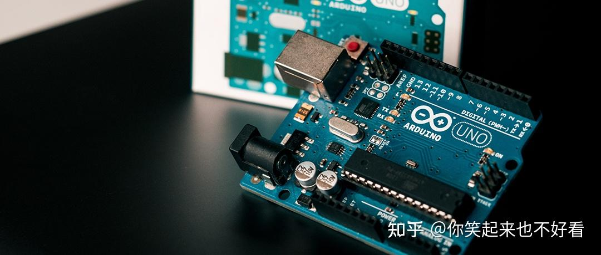

### 开发流程速览

一个完整的单片机开发过程，可以概括为一套标准的流程：

1. **代码编写：** 使用**IDE**撰写程序逻辑。

2. **编译/链接：** 将高级语言转化为机器可识别的二进制指令。

3. **烧录：** 将程序固化到芯片的存储器中。

4. **调试：** 确保程序在硬件上稳定、正确地运行。

   

### 本次分享大纲

我们将围绕三个核心环节展开：

- **开发工具链：** 介绍主流单片机平台（如STM32、ESP32等）及其IDE的选择。
- **硬件架构基础：** 以 **STM32F407** 为例，剖析其内部 **总线架构**，理解数据流转机制。
- **底层运行机制：** 探讨为什么多种语言可以开发单片机，以及程序代码最终如何转换为二进制指令，并在芯片架构上高效执行。

希望通过本次分享，大家能对单片机开发有一个**从表层工具到深层原理**的全面认识。让我们开始今天的探索吧

## 二、 单片机集成开发环境（IDE）与主控平台介绍

###  IDE 的核心作用

IDE，即**集成开发环境（Integrated Development Environment）**，是单片机开发不可或缺的核心工具。它的作用可以形象地比喻为嵌入式工程师的“驾驶舱”。

| **核心功能**                      | **描述**                                                     | **重要性**                                     |
| --------------------------------- | ------------------------------------------------------------ | ---------------------------------------------- |
| **代码编辑 (Code Editing)**       | 提供**语法高亮**、自动补全、代码折叠等，提高编写效率。       | **效率基石**：保障代码书写规范和速度。         |
| **编译/链接 (Compile/Link)**      | 内嵌编译器和链接器，将人类可读的高级语言转化为机器可执行的二进制文件。 | **实现核心**：是代码转化为芯片指令的必经之路。 |
| **项目管理 (Project Management)** | 统一管理源代码文件、头文件、库文件和编译配置。               | **结构保障**：确保大型项目的组织性和可维护性。 |
| **调试与仿真 (Debug/Simulate)**   | 允许程序断点设置、单步执行、查看寄存器和内存状态。           | **质量关键**：帮助定位和修复程序中的逻辑错误。 |

### 常见单片机平台与对应 IDE/工具链（主要是个功能不同）

#### 1. **ESP32 (乐鑫科技)：物联网首选——**[ESP32｜乐鑫科技](https://www.espressif.com.cn/zh-hans/products/hardware/esp32)

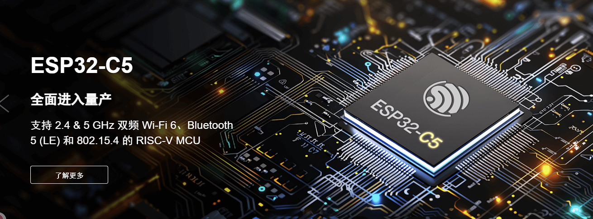

- **平台特性：** 强大的 Wi-Fi 和蓝牙连接能力，常用于物联网（IoT）应用。基于 **Xtensa/RISC-V** 架构。

- **主流 IDE/工具链：**

  - **ESP-IDF (Espressif IoT Development Framework)：** 乐鑫官方的开发框架，基于 **C/C++** 和 **CMake** 构建系统，提供了最底层的驱动和最全面的配置选项，适合追求高性能和定制化的专业开发。

    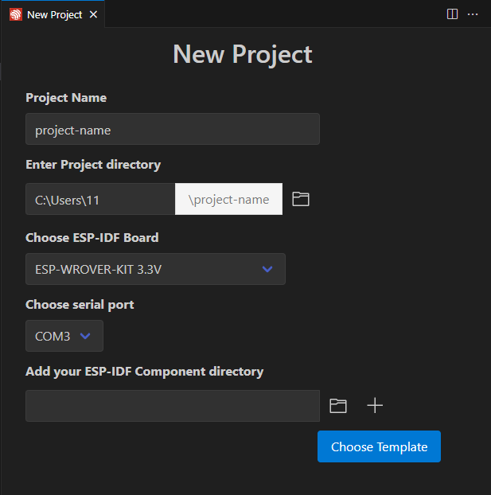

  - 都开始在vscode中进行插件的配置了

#### 2. **STM32 (STMicroelectronics)：市场占有率王者**

- **平台特性：** 基于 **ARM Cortex-M** 系列内核，型号众多，覆盖高性能、低功耗等需求。拥有完善的生态系统和丰富的库函数。

- **主流 IDE/工具链 (双雄)：**

  - **Keil MDK (Microcontroller Development Kit) - uVision：** 历史悠久，功能强大，**调试功能成熟**，是许多工业和商业项目的首选。

    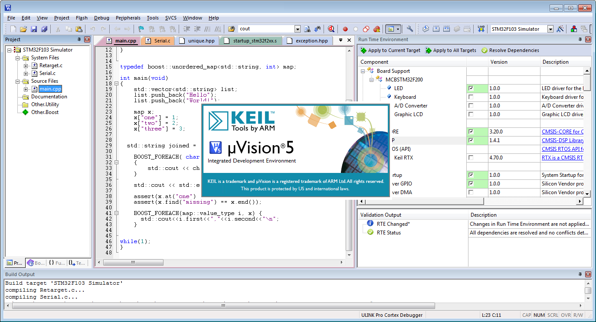

  - **STM32CubeIDE：** ST 官方力推的 **免费** 跨平台 IDE，集成了配置工具 **STM32CubeMX**，图形化配置时钟、GPIO和外设，大幅简化了初始化代码的编写。

    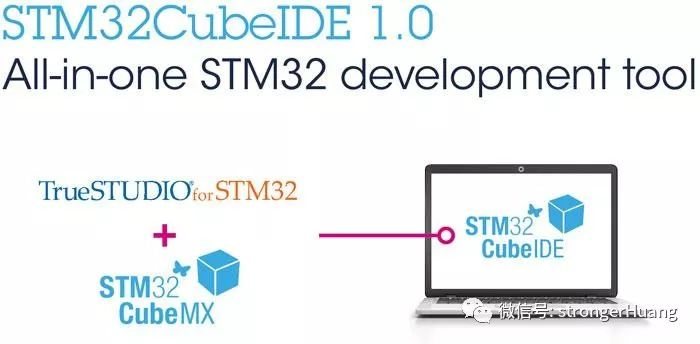

#### 3. **GD32 (兆易创新)：国产替代与兼容性**——[兆易创新GD32 MCU](https://www.gd32mcu.com/cn)

- **平台特性：** 同样基于 **ARM Cortex-M** 内核，以高性能和高性价比著称。与 STM32 具有 **高度的引脚和代码兼容性**。
- **常用工具链：**
  - 鉴于其高兼容性，GD32 通常可直接使用 **Keil MDK** 或 **IAR Embedded Workbench** 进行开发。部分厂商也推出了基于 GCC 的免费工具链。

#### 4. **STC32 (宏晶科技)：国内普及的8位/32位机**——[STC Microcontrollers-STCmicro Technology Co,.Ltd](https://www.stcmicro.com/index.html)

- **平台特性：** 国内普及率较高的 **8051** 增强型单片机（也有32位系列）——就是我们用到的51单片机，特点是**内部集成高精度时钟，无需外部晶振**，且具有独特的加密和烧录方式。
- **专用工具链：**
  - 需使用 **STC 官方提供的编程下载软件** 进行代码的烧录，通常搭配 Keil C51 或 Keil MDK 进行代码编写。

#### 5. **MSP430 (Texas Instruments)：超低功耗专家**

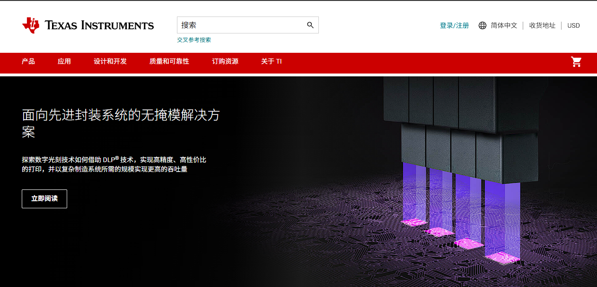

- **平台特性：** TI 推出的 16 位单片机，以 **极低的功耗** 著称，广泛应用于电池供电和计量仪表领域。
- **主流 IDE/工具链：**
  - **Code Composer Studio (CCS)：** TI 官方的集成开发环境，基于 Eclipse 框架，对 TI 全系列芯片（包括DSP和MCU）提供全面的支持和高效的调试能力。

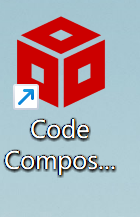

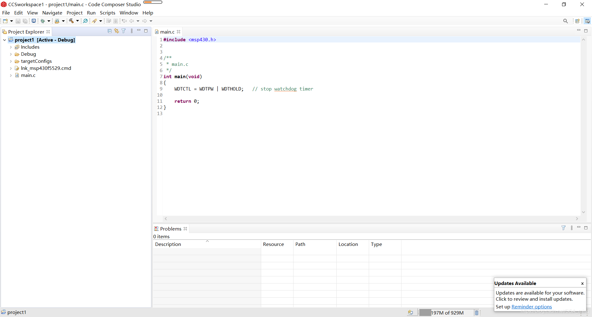

页面这个样子

###  拓展内容：跨平台开发的优势与趋势

随着开源和通用工具的普及，**跨平台开发工具** 正在成为一种趋势。

- **PlatformIO：** 一个开源的生态系统，可以安装在 VS Code 或 Atom 等编辑器上。
  - **核心优势：** 它可以支持 **数百种** 单片机和开发板，仅需一套工具链就能在不同平台上进行开发，极大地提高了开发者的灵活性和学习效率。
- **趋势：** 这种趋势反映了开发者对于**统一化、模块化**开发环境的需求，将开发工具与底层芯片解耦，使工程师能更专注于应用层逻辑的实现。

接下来，我们将以 STM32F407 为例，深入探讨它的总线架构，理解这些代码指令在硬件内部是如何流转的。

## 三、硬件架构基础：以STM32F407为例的总线系统

### STM32F407 简介：性能与应用

**核心：** STM32F407 系列单片机基于 **ARM Cortex-M4** 处理器内核。

**性能：** 主频最高可达 **168 MHz**，拥有高速片上存储器（SRAM和Flash）。

###  总线（Bus）的概念与作用：数据的“高速公路”

- **定义：** 总线是一组用于在计算机系统（在单片机中即为芯片内部）的各个组件之间传输数据、地址和控制信号的**公共通道**。
- **作用：**
  1. **数据传输：** 承载CPU、内存、外设之间的数据交换。
  2. **寻址：** 传递地址信号，确保数据准确地发送到目标设备。
  3. **控制：** 传输控制信号（如读/写请求、中断信号），协调各设备的工作。

### STM32F407/Cortex-M4 的总线架构

STM32F407 采用了一种典型的嵌入式系统架构——**哈佛（Harvard）架构**，并在此基础上构建了一个多层次、多主机的总线矩阵。

> **🔍 哈佛架构（Harvard Architecture）：** 最大的特点是 **程序存储器** 和 **数据存储器** 拥有独立的地址和数据总线。这种设计允许 CPU **同时** 获取指令（从程序存储器）和读取/写入数据（从数据存储器），从而实现**指令和数据存取并行操作**，极大地提高了 CPU 的运行效率和吞吐率。

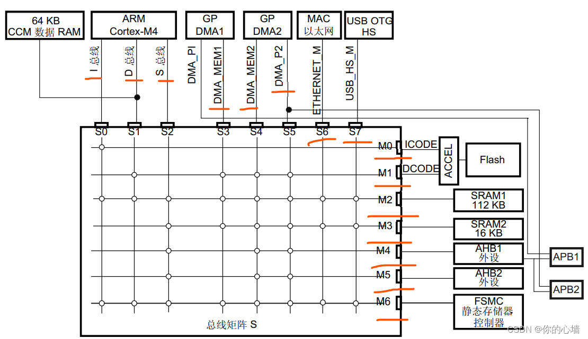

STM32F407 的总线系统被称为 **多层 AHB 总线矩阵**，它主要划分了两大类总线：

#### 1. System Bus (S总线 - 系统总线) - AHB

- **全称：** **AHB (Advanced High-performance Bus) - 高性能总线**。
- **特点：** 高速、高带宽、低延迟。
- **连接对象：** 主要连接对速度要求极高的设备，如：
  - **CPU 内核** (作为总线主机，Master)
  - **SRAM** (高速随机存取存储器)
  - **FLASH** (程序存储器，用于存储代码)
  - **DMA (Direct Memory Access) 控制器** (作为总线主机)

#### 2. Data Bus (D总线 - 数据总线) - APB

- **全称：** **APB (Advanced Peripheral Bus) - 高级外设总线**。
- **特点：** 速度相对较低，但**功耗更低**，适合连接速度较慢的外设。APB 总线通过 **AHB-APB 桥** 连接到高性能的 AHB 总线矩阵上。
- **连接对象：** 主要连接中低速外设，如：
  - **USART/SPI/I2C** (串行通信接口)
  - **Timer** (定时器)
  - **GPIO** (通用输入输出端口)

#### 3.I 总线

用于M4内核获取指令，对象是包含代码的存储器（内部Flash/SRAM 或通过 FSMC 的外部存储器）

[总线结构讲解视频链接](https://www.douyin.com/video/7558846322376215817)——主要看IDS三个总线

### 架构总结：分级总线架构的优势

STM32F407 采用的这种 **分级（AHB/APB）**、**多主机的总线矩阵架构** 带来了显著的优势：

1. **提高并行性：** 由于采用哈佛架构和多层总线，允许 CPU、DMA、多个总线主机**同时**访问不同的资源，**提高了数据吞吐率**。
2. **优化资源分配：** 将高速设备和低速设备分置于不同的总线层级，可以为高速设备提供更优的性能保证，同时也避免了高速设备被低速设备拖慢。
3. **系统可扩展性：** 清晰的分层结构便于设计者进行模块化设计和扩展。

## 四、多语言开发支持：为什么可以“条条大路通MCU”

### MCU 的“母语”：机器语言

我们首先必须明确一个前提：无论工程师使用哪种编程语言编写代码，单片机的中央处理单元（CPU，如 Cortex-M4）最终能且只能识别和执行 **机器语言**。

- **机器语言：** 是由 **二进制数字（0和1）** 组成的指令集。
- **指令集：** 不同的 CPU 架构（如 ARM, x86, RISC-V）有自己特定的机器指令格式，这决定了 CPU 可以执行的基本操作（如加、减、数据移动等）。

因此，所有高级语言，本质上都是一种 **抽象和翻译** 的过程，其最终目的都是生成符合目标 MCU 架构的机器语言序列。

### 语言的层次：从贴近硬件到追求效率

单片机开发所使用的语言可以根据其抽象程度分为三个主要层次：

#### 1. 低级语言：机器语言/汇编语言

- **特点：** 直接操作寄存器和内存地址，与硬件指令集一一对应。
- **优势：** **执行效率最高**，生成的代码体积最小，在对时序和性能要求极高的底层驱动和启动代码中仍被广泛使用。
- **劣势：** **开发难度大**，代码可读性和可移植性极差，更换芯片架构需要完全重写。
  - *示例：* 一条汇编指令 `MOV R0, #5` 直接对应一条机器码。

#### 2. 中级语言：C/C++ 语言

- **特点：** 提供了结构化编程的能力，但同时保留了直接操作内存（指针）和位操作的能力，是连接高级抽象和底层硬件的桥梁。

  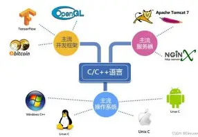

- **优势：**

  - **效率高：** 通过高效的编译器，可以生成接近汇编的执行效率。
  - **可移植性强：** 程序逻辑可以相对容易地移植到不同架构的 MCU 上。
  - **主流地位：** 拥有最丰富的库、最成熟的工具链和最庞大的开发者社区。

#### 3. 高级语言：解释型/脚本语言 (如 MicroPython/Lua)

- **特点：** 提供了强大的抽象能力和丰富的内置功能，让开发者可以专注于应用逻辑，而不必关心底层细节。

  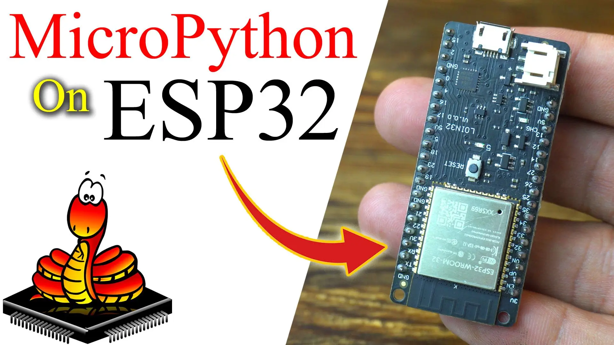

- **运行机制：** 这类语言本身并不能直接在 MCU 上运行。它们依赖于一个 **解释器（Interpreter）** 或 **虚拟机（Virtual Machine, VM）**，这个解释器/VM 才是用 C/C++ 编写并烧录到 MCU 上的主程序。

  - *过程：* **Python 代码 -> VM 解释执行 -> VM 调用底层 C 语言驱动。**

- **优势：** **开发效率极高**，代码简洁，适合快速原型开发和物联网应用。

- **劣势：** **牺牲了性能** 和 **内存占用**（需要额外的 RAM 和 FLASH 空间来运行解释器）。

### 核心原因：编译与链接——将抽象转化为指令

“条条大路通 MCU”的核心秘密，在于强大的 **编译器（Compiler）** 和 **链接器（Linker）** 工具链。

| **语言类型**    | **转换工具**      | **转换过程**                                                 | **关键结果**                      |
| --------------- | ----------------- | ------------------------------------------------------------ | --------------------------------- |
| **C/C++**       | **编译器/链接器** | **编译**：高级代码 $\rightarrow$ 汇编代码 $\rightarrow$ 目标文件。**链接**：目标文件 + 库文件 $\rightarrow$ **可执行的机器码文件**。 | 直接生成 MCU 的原生机器指令。     |
| **MicroPython** | **解释器**        | 脚本代码在 **已烧录的虚拟机** 中逐行解释，实时翻译成机器指令并执行。 | 虚拟机（C语言程序）间接驱动 MCU。 |

**总结：** 无论是通过编译器**一次性翻译**（C/C++），还是通过虚拟机**实时翻译**（MicroPython），最终进入 CPU 执行单元的，都必须是目标架构的 **机器语言**。正是因为有了这些翻译工具，我们才能使用更高级、更易于人类理解的语言来开发嵌入式系统。

### 拓展内容：库（Library）在开发中的作用

为了简化开发，避免重复编写底层驱动代码，单片机厂商和社区提供了各种**库（Library）**。

| **库的类型**                                  | **描述**                                                     | **主要作用**                                    | **适用语言** |
| --------------------------------------------- | ------------------------------------------------------------ | ----------------------------------------------- | ------------ |
| **标准库 (Standard Peripheral Library, SPL)** | 较老旧，但效率高。直接操作寄存器，用户需要对硬件原理非常熟悉。 | 封装了硬件寄存器操作，提供底层控制函数。        | C/C++        |
| **HAL 库 (Hardware Abstraction Layer)**       | 厂商力推（如 STM32 的 HAL 库）。提供更高级的 API 接口，实现 **硬件抽象**。 | 提高代码的可移植性，将底层驱动和应用逻辑分离。  | C/C++        |
| **固件库/SDK (Software Development Kit)**     | 厂商提供的完整软件工具包（如 ESP-IDF）。包含 OS、网络协议栈、驱动等。 | 搭建复杂的应用场景，如 Wi-Fi 通信、文件系统等。 | C/C++/Python |

这些库极大地提升了开发效率，工程师只需调用高级函数，而无需关心复杂的寄存器操作，进一步降低了不同语言开发单片机的门槛。

## 五、从代码到运行：编译结果的底层执行机制

### 编译与链接过程分解：代码的转化与组装

我们的 C/C++ 代码需要经历一个复杂而精密的“翻译”过程，才能成为 MCU 能够理解的机器码。

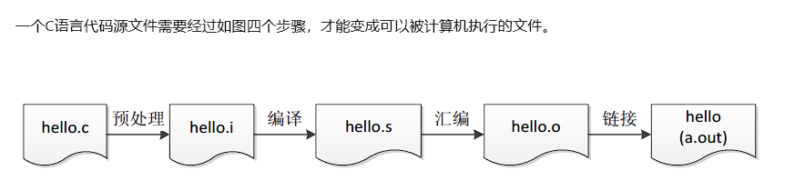

#### 1. 编译 (Compilation)——[程序详细编译过程（预处理、编译、汇编、链接） - 知乎](https://zhuanlan.zhihu.com/p/476697014)

- **输入：** 源代码文件（如 `.c` 或 `.cpp` 文件）。
- 中间过程`.s`文件
- **过程：** 编译器（如 GCC 或 ARMCC）将高级语言代码转化为低级的 **汇编语言**，然后再将汇编语言转化为 **目标文件（Object File，如 `.o` 文件）**。
- **特性：** 每个源代码文件通常会独立生成一个目标文件，这个文件中的地址信息是相对的，还不能直接运行。

#### 2. 链接 (Linking)

- **输入：** 多个目标文件、**启动代码（Startup Code）**、标准库或 HAL 库文件。
- **过程：** 链接器（Linker）的工作是解析这些文件中的所有符号（变量名、函数名），并根据 **链接脚本（Linker Script）** 统一分配它们的**绝对内存地址**（即程序代码放在 FLASH 的哪个地址，变量放在 RAM 的哪个地址）。
- **输出：** 生成一个完整的、包含所有符号信息的 **可执行文件**（通常是 **`.elf`** 或 **`.axf`** 格式）。

#### 3. 格式转换与烧录

- **目的：** `.elf` 文件虽然可执行，但包含了调试符号等额外信息，不适合直接烧录。
- **过程：** 使用 `objcopy` 等工具，将 `.elf` 文件剥离调试信息，转化为适合烧录的精简格式，如 **`.bin` (纯二进制文件)** 或 **`.hex` (Intel Hex 格式)**。
- **烧录：** 通过调试器（如 ST-Link、J-Link）和烧录软件，将 `.bin`/`.hex` 文件传输到 MCU 内部的 **FLASH 存储器** 中。

### 运行机制：二进制文件在芯片上的旅程

当代码以二进制形式存储在 FLASH 中后，芯片上电时，便开始了程序的执行。

#### 1. 存储与加载（Memory Map）

- **FLASH（程序存储器）：** 存储**代码（Code）\**和\**常量（Const Data）**。它是**非易失性**的，断电后内容不丢失。
- **SRAM（数据存储器）：** 存储**全局变量**、**局部变量**、**堆栈（Stack）\**和\**堆（Heap）**。它是**易失性**的，上电后需初始化。

#### 2. 启动过程（The Boot Process）

1. **复位：** 芯片上电或按下复位键。
2. **SP 和 PC 初始化：**
   - **堆栈指针（SP - Stack Pointer）：** 被加载为 FLASH 存储区开始地址处的第一个 32 位字（即**栈顶地址**）。
   - **程序计数器（PC - Program Counter）：** 被加载为 FLASH 存储区开始地址处的第二个 32 位字，这个地址被称为 **复位向量（Reset Vector）**，它指向我们程序的真正入口——通常是启动代码（Startup Code）中的 `Reset_Handler` 函数。
3. **启动代码执行：** 启动代码负责设置时钟、初始化堆栈、将必要的初始数据从 FLASH 复制到 SRAM，并最终跳转到我们的 C 语言入口函数 `main()`。

#### 3. 指令执行（Fetch-Decode-Execute Cycle）

一旦进入 `main()` 函数，CPU 就进入了经典的指令执行循环：

- **取出 (Fetch)：** CPU 通过 **S 总线 (AHB)**，从 FLASH 存储器中获取 PC 指针指向的下一条指令的机器码。
- **译码 (Decode)：** **指令译码器** 解析机器码，确定这是一条什么操作（加法、数据移动、跳转等），以及需要操作哪些寄存器。
- **执行 (Execute)：** **算术逻辑单元（ALU）** 或其他功能单元执行指令。例如：
  - 如果是数据操作，ALU 进行计算。
  - 如果是内存访问（如读写 GPIO），CPU 通过 **D 总线 (APB)** 与外设进行交互。
- **更新 PC：** 程序计数器（PC）更新，指向下一条指令的地址。

### 总结：抽象到底层的回归

本次分享从最顶层的 IDE 工具开始，深入到总线架构，再到最后的代码执行。我们强调的重点是：

> **所有的高级抽象（如 C 语言函数、对象、库调用）最终都必须回归到芯片架构上的底层指令和数据流转。** 编译和链接是实现这一转换的桥梁，而总线架构和 CPU 执行机制则是支撑这一转换高效、并行运行的物理基础。

## 六、拓展

###  调试利器：JTAG/SWD 调试原理

JTAG（Joint Test Action Group）和 SWD（Serial Wire Debug）是目前嵌入式领域最常用的**硬件调试接口**，它们是连接外部调试器（如 J-Link、ST-Link）与目标 MCU 的桥梁。

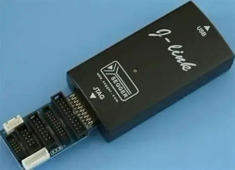

#### 1. JTAG 与 SWD 概述

| **特性**     | **JTAG (4/5 线)**                        | **SWD (2 线)**                                |
| ------------ | ---------------------------------------- | --------------------------------------------- |
| **接口定义** | TCK, TMS, TDI, TDO, nTRST（可选）        | SWCLK, SWDIO                                  |
| **带宽**     | 较高（并行数据传输）                     | 较低（串行数据传输）                          |
| **引脚占用** | 较多（至少 4 根）                        | **极少 (2 根)**                               |
| **现状**     | 功能强大，常用于复杂系统和边界扫描测试。 | **Cortex-M 系列主流**，因其引脚占用少而流行。 |

#### 2. JTAG/SWD 的核心工作原理

JTAG/SWD 接口通过连接到 MCU 内部的 **调试访问端口 (DAP)** 来实现对 CPU 核心的控制。

- **调试访问端口 (DAP):**
  - DAP 是 MCU 内部的一个专用电路模块，它允许外部调试器通过 JTAG/SWD 协议**非侵入性地**访问 CPU 的内部资源（如寄存器、内存和外设）。
  - 它是连接 **总线访问端口 (AHB-AP)** 和 **核心访问端口 (CSW-AP)** 的枢纽。

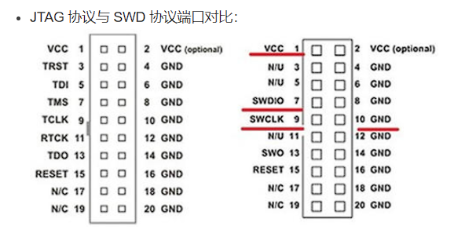

#### 3. 程序暂停与单步执行的实现

调试器控制程序执行流程的能力，依赖于 Cortex-M 内核内部的专用调试寄存器和机制：

| **操作**          | **机制实现**                        | **描述**                                                     |
| ----------------- | ----------------------------------- | ------------------------------------------------------------ |
| **设置断点**      | **断点单元 (Breakpoint Unit, BPU)** | 调试器向 BPU 写入要设置断点的代码地址。当 CPU 的 **程序计数器 (PC)** 匹配到该地址时，BPU 触发一个**调试中断**，使 CPU 暂停执行。 |
| **暂停/恢复**     | **DHCSR 寄存器**                    | 调试器向 **调试暂停控制和状态寄存器 (DHCSR)** 写入特定的位（如 C_DEBUGEN 和 C_HALT），可以直接强制 CPU 暂停或恢复执行。 |
| **单步执行**      | **STEPEN 位**                       | 当 CPU 暂停时，调试器清除 DHCSR 中的 C_HALT 位，并设置 **STEPEN** 位。CPU 执行一条指令后会立即再次触发调试中断并暂停，从而实现单步调试。 |
| **查看变量/内存** | **AHB 访问端口**                    | 调试器利用 DAP 的 AHB 访问端口，直接作为总线主机（Master）访问 SRAM 或外设寄存器，读取或修改数据，而无需 CPU 参与。 |

> **总结：** JTAG/SWD 机制通过利用 CPU 内部预留的硬件调试模块，实现了对程序执行流的完全控制，这是现代嵌入式系统高效开发和故障排除的基础。

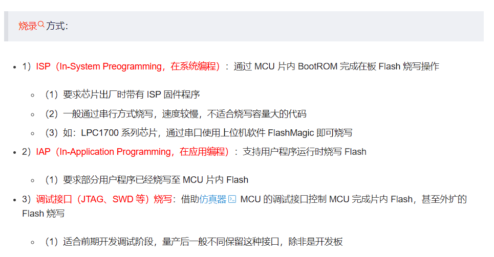