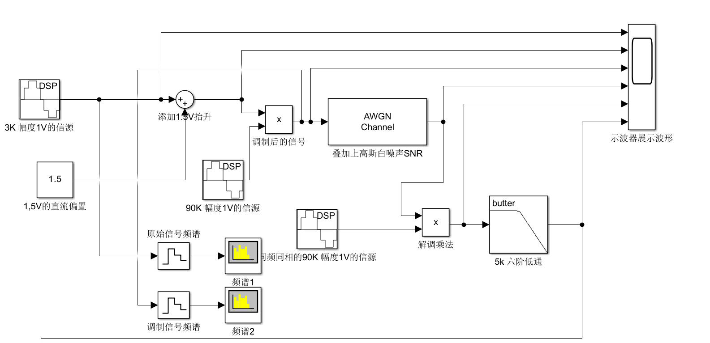
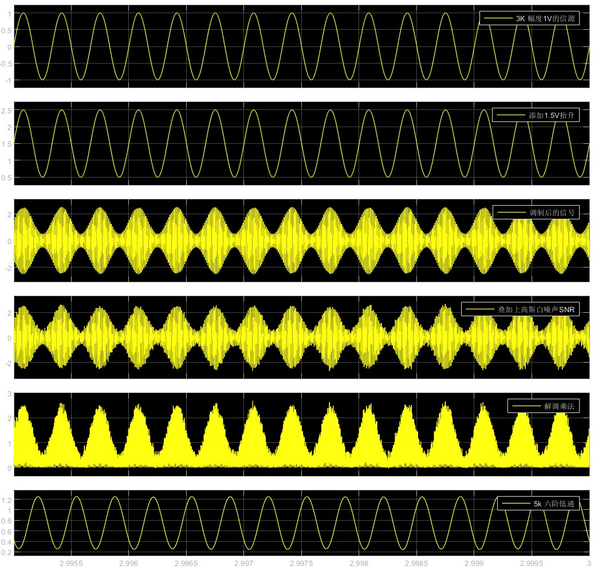
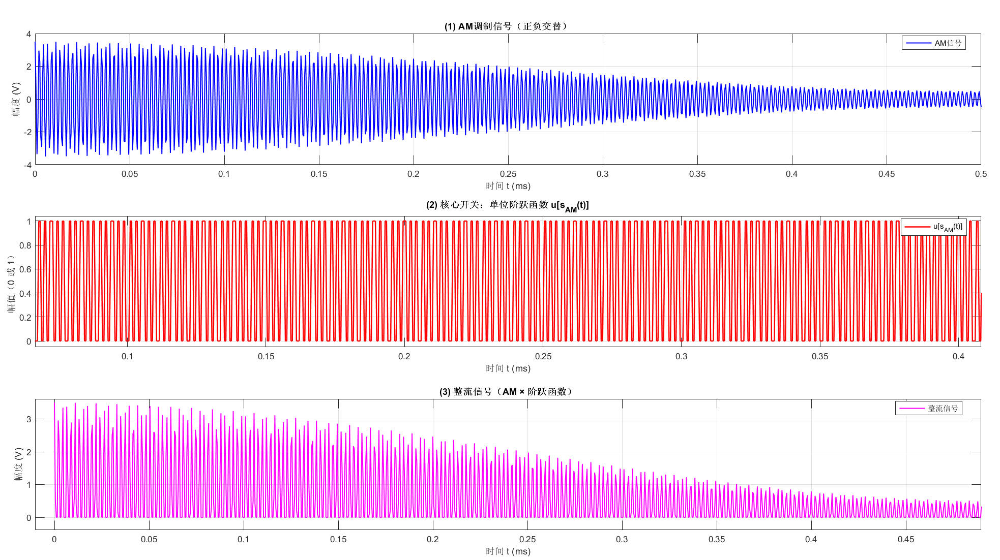
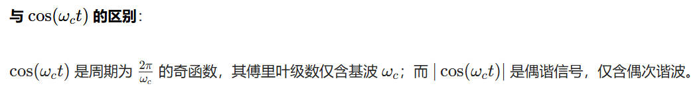
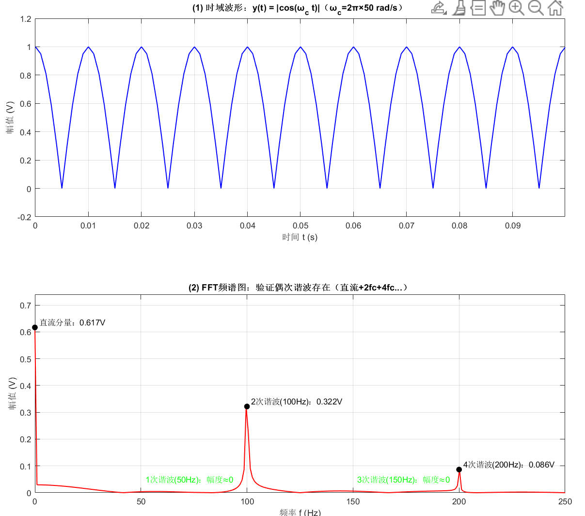

- 常规 AM（DSB-AM）——常规双边带幅度调制  
- DSB（DSB-SC）——抑制载波的双边带调制

# ma调制指数计算

常规调幅（DSB-AM，双边带全载波调幅）是唯一具有传统意义上**调制指数 $m_a$​** 的调幅方式。

该参数是衡量调幅深度和失真风险的关键指标。调制指数 $m_a$ 衡量的是已调波包络的**最大变化程度**。在常规 AM 中，已调波的包络电压 $V_{\text{包络}}(t)$ 是由直流偏置 $V_c$ 和调制信号 $V_{cm}\cos(\Omega t)$ 共同决定的：

$V_{\text{包络}}(t) = V_c + V_{cm}\cos(\Omega t) = V_c \left(1 + m_a\cos(\Omega t)\right)$

## 调制指数 $m_a$ 的定义与公式

调制指数 $m_a$ 定义为调制信号最大振幅 $V_{cm}$ 与载波静态幅度 $V_c$（或称直流偏置）的比值。

- 公式：

  $$m_a = \frac{V_{cm}}{V_c}$$

- **参数说明：**

  - $V_{cm}$：**调制信号**（如低频正弦信号）的**最大振幅**（峰值）。
  - $V_c$：**载波的静态幅度**（即未调制时的载波峰值，**由直流偏置决定**）。

- 取值限制：

  调制指数 $m_a$ 的取值范围必须满足：

  $$0 \le m_a \le 1$$

  当 $m_a > 1$ 时，信号将发生过调制失真（包络检波器无法正确还原调制信号）。

##  $m_a$ 与直流偏置 $V_c$ 的关系计算

根据 $m_a$ 的定义公式，在已知调制信号振幅 $V_{cm}$ 和目标调制指数 $m_a$ 的情况下，可以**直接计算出所需的直流偏置 $V_c$**。

**已知条件：**

- 调制信号振幅 $V_{cm} = 1\text{V}$
- 目标调制指数 $m_a$（待定）

公式推导：

由 $m_a = \frac{V_{cm}}{V_c}$ 可得：

$$V_c = \frac{V_{cm}}{m_a}$$

**具体计算示例：**

| **目标 ma** | **所需直流偏置 Vc**           | **结果**       | **调制状态**   |
| ----------- | ----------------------------- | -------------- | -------------- |
| $m_a = 0.5$ | $V_c = \frac{1\text{V}}{0.5}$ | $2.0\text{V}$  | 欠调制         |
| $m_a = 0.8$ | $V_c = \frac{1\text{V}}{0.8}$ | $1.25\text{V}$ | 欠调制         |
| $m_a = 1.0$ | $V_c = \frac{1\text{V}}{1.0}$ | $1.0\text{V}$  | **临界无失真** |

# 基于乘法器的 AM 调制实现与 $m_a$ 的关系

在实际的调制电路中，常采用**加偏置**后与载波**相乘**的方式实现常规 AM 调制。

##  调制过程的数学表示

1. 调制信号加偏置：

   原始调制信号为 $m(t) = V_{cm}\cos(\Omega t)$。

   加入直流偏置 $V_b$ 后，输入乘法器的信号为：

   $$v_{in}(t) = V_b + V_{cm}\cos(\Omega t)$$

2. 与载波相乘：

   无偏置载波为 $c(t) = A_c\cos(\omega_c t)$。

   最终的已调波 $s(t)$ 为两者相乘：

   $$s(t) = c(t) \cdot v_{in}(t) = A_c \left(V_b + V_{cm}\cos(\Omega t)\right) \cos(\omega_c t)$$

## 与常规 AM 标准式的对应

常规 AM 的标准时域表达式为：

$$s(t) = V_c \left(1 + m_a\cos(\Omega t)\right) \cos(\omega_c t)$$

将乘法器得到的 $s(t)$ 表达式展开：

$$s(t) = (A_c V_b) \cdot \left(1 + \frac{V_{cm}}{V_b}\cos(\Omega t)\right) \cdot \cos(\omega_c t)$$

通过对比，可以得出如下**等价关系**：

1. 常规 AM 的 “载波静态幅度” $V_c$：

   $$V_c = A_c \cdot V_b$$

   $V_c$ 是载波振幅 $A_c$ 和偏置电压 $V_b$ 的乘积。

2. 调制指数 $m_a$：

   $$m_a = \frac{V_{cm}}{V_b}$$

   核心结论： 调制指数 $m_a$ 仅由调制信号振幅 $V_{cm}$ 和所加的偏置 $V_b$ 决定，与载波振幅 $A_c$ 没有直接关系。只要 $V_b$ 固定，不管 $A_c$ 怎么变化，$m_a$ 都不变。

## 载波振幅 $A_c$ 的实际工程限制

虽然 $A_c$ 不影响 $m_a$ 的计算值，但在实际系统中 $A_c$ **不能任意选取**，必须考虑以下工程因素：

- **功率限制：** $A_c$ 越大，已调波 $s(t)$ 的总功率越大。必须保证总功率**不超过**发射设备的**功率上限**。
- **信噪比 (SNR) 要求：** $A_c$ 不能太小，否则已调波幅度过弱，在接收端解调时容易被**噪声淹没**，影响通信质量。
- **设备适配与失真：** $A_c$ 需匹配后续放大、滤波等电路的**线性输入范围**。如果 $A_c$ 过大，会导致信号在电路中被“截断”，产生**削波失真**。

## 三种调制状态的定义

### 欠调制（Under-modulation）

- **条件：** $0 \le m_a < 1$

- 物理表现： 调制信号的最大幅度 $V_{cm}$ 小于直流偏置 $V_c$。

  $$V_{cm} < V_c$$

- 结果： 在 $m_a = 0.5$ 的例子中，$V_{cm} = 1\text{V}$，而 $V_c = 2.0\text{V}$。

  此时，包络的最小幅度为：

  $$V_{\text{包络, min}} = V_c - V_{cm} = 2.0\text{V} - 1.0\text{V} = 1.0\text{V}$$

  包络在任何时刻都不会降到零或变为负值。这是无失真调制的理想状态，但效率较低。

###  临界调制（Critical Modulation 或 Full Modulation）

- **条件：** $m_a = 1$

- 物理表现： 调制信号的最大幅度 $V_{cm}$ 等于直流偏置 $V_c$。

  $$V_{cm} = V_c$$

- 结果： 包络的最小幅度恰好为零：

  $$V_{\text{包络, min}} = V_c - V_{cm} = 1.0\text{V} - 1.0\text{V} = 0\text{V}$$

  这是最大无失真调制，功率效率最高。

###  过调制（Over-modulation）

- **条件：** $m_a > 1$

- 物理表现： 调制信号的最大幅度 $V_{cm}$ 大于直流偏置 $V_c$。

  $$V_{cm} > V_c$$

- 结果： 包络的最小幅度将变为负值 ($V_{\text{包络, min}} < 0$)。

  这会导致信号的包络出现削波失真，无法通过常规的包络检波器正确解调出原始调制信号。

# 相干解调

## 仿真导入

这个是后期通信原理的一个基于`Matlab`的`AM`调制以及相干解调的仿真

接下来我给出示波器所展示的波形的图片

第5行显示的波形，是相干解调后还没有经过低通滤波的原始波形

**看见这张图片我们会产生一个疑问？ 为什么在相干解调前信号有正有负，但是相干解调后，所有的信号都在0以上？**

这一块的原因其实是数学上的原因，具体如下：

# 为什么相干解调相乘后信号全在零轴以上？（数学本质）

##  AM信号的先天结构  
调幅信号的表达式为：  
$$
s_{\text{AM}}(t) = \underbrace{\left[ A + m(t) \right]}_{\text{非负包络}} \cdot \cos(\omega_c t)
$$
其中 **包络 $A + m(t) \geq 0$**（调幅基本要求，避免“过调幅”失真），载波 $\cos(\omega_c t)$ 是**正负交替**的高频振荡（取值范围 $[-1, +1]$）。  

## 相干解调的“相乘”操作  
解调第一步，接收信号与**同频同相的本地载波** $\cos(\omega_c t)$ 相乘：  
$$
s_{\text{product}}(t) = s_{\text{AM}}(t) \cdot \cos(\omega_c t) = \left[ A + m(t) \right] \cdot \cos^2(\omega_c t)
$$

## $\cos^2(\omega_c t)$ 的非负性推导  
核心是 **平方运算的数学性质** + **三角恒等式**：  

- **取值范围分析**：  
  载波 $\cos(\omega_c t) \in [-1, +1]$，但平方后：  
  $$
  \cos^2(\omega_c t) = \left[ \cos(\omega_c t) \right]^2 \geq 0
  $$
  即 $\cos^2(\omega_c t)$ **始终非负**（取值范围 $[0, +1]$）。  

- **三角恒等式验证**：  
  利用公式 $\cos^2(x) = \frac{1 + \cos(2x)}{2}$，令 $x = \omega_c t$，则：  
  $$
  \cos^2(\omega_c t) = \frac{1}{2} + \frac{1}{2}\cos(2\omega_c t)
  $$
  由于 $\cos(2\omega_c t) \in [-1, +1]$，代入得：  
  $$
  \frac{1}{2} + \frac{1}{2}\cos(2\omega_c t) \in \left[ \frac{1-1}{2}, \frac{1+1}{2} \right] = [0, +1]
  $$
  进一步证明 $\cos^2(\omega_c t)$ 恒非负。  

##  最终波形的非负性  
回到相乘结果 $s_{\text{product}}(t)$：  
- 包络 $A + m(t) \geq 0$（调幅约束），  
- 因子 $\cos^2(\omega_c t) \geq 0$（平方性质）。  

两者**非负相乘**，故：  
$$
s_{\text{product}}(t) = \underbrace{\left[ A + m(t) \right]}_{\geq 0} \cdot \underbrace{\cos^2(\omega_c t)}_{\geq 0} \geq 0
$$
即 **相乘后信号必然全在零轴上方**。  

# 相干解调中低通滤波还原基带信号的数学原理

## 滤波前的信号基础
相干解调第一步“相乘”后，得到的信号为：  
$$
s_{\text{product}}(t) = \left[ A + m(t) \right] \cdot \cos^2(\omega_c t)
$$

结合三角恒等式 $\cos^2(\omega_c t) = \frac{1}{2} + \frac{1}{2}\cos(2\omega_c t)$，将上式**展开分离高低频分量**：  
$$
\begin{align*}
s_{\text{product}}(t) &= \left[ A + m(t) \right] \cdot \left( \frac{1}{2} + \frac{1}{2}\cos(2\omega_c t) \right) \\
&= \underbrace{\frac{A}{2} + \frac{1}{2}m(t)}_{\text{低频分量（含基带信号）}} + \underbrace{\frac{A}{2}\cos(2\omega_c t) + \frac{1}{2}m(t)\cos(2\omega_c t)}_{\text{高频分量（倍频载波）}}
\end{align*}
$$

## 低通滤波的核心作用：分离高低频
### 信号分量的频率特性
- **低频分量**：$\frac{A}{2} + \frac{1}{2}m(t)$  
  其中 $m(t)$ 是**基带信号**（如语音、图像信号），其最高频率为 $f_m$（通常远小于载波频率 $f_c$，即 $f_m \ll f_c$），因此该分量的频率范围集中在 $[0, f_m]$。  

- **高频分量**：$\frac{A}{2}\cos(2\omega_c t) + \frac{1}{2}m(t)\cos(2\omega_c t)$  
  - 第一项是 $2\omega_c$（即 $2f_c$）的纯倍频载波，频率固定为 $2f_c$；  
  - 第二项是基带信号 $m(t)$ 对 $2\omega_c$ 载波的调幅，频率范围集中在 $[2f_c - f_m, 2f_c + f_m]$；  
  - 核心特征：高频分量的最低频率 $2f_c - f_m \gg f_m$（因 $f_c \gg f_m$），与低频分量无重叠。  

### 低通滤波器的参数选择
需选用 **截止频率 $f_L$** 满足以下条件的低通滤波器（LPF）：  
$$
f_m < f_L < 2f_c - f_m
$$

- 作用：允许低频分量 $\frac{A}{2} + \frac{1}{2}m(t)$ 完全通过，同时彻底抑制所有高频分量（$2f_c$ 附近的信号）。  

## 滤波后的输出与基带信号还原
### 低通滤波的数学结果
经过低通滤波后，高频分量被完全滤除，仅保留低频分量，滤波器输出 $s_{\text{LPF}}(t)$ 为：  
$$
s_{\text{LPF}}(t) = \frac{A}{2} + \frac{1}{2}m(t)
$$

### 还原原始基带信号 $m(t)$
对滤波输出做简单线性变换，即可剥离直流分量 $\frac{A}{2}$，还原 $m(t)$：  
$$
m(t) = 2s_{\text{LPF}}(t) - A
$$

## 数学本质总结
1. 相乘操作的核心是通过 $\cos^2(\omega_c t)$ 的恒等变换，将基带信号 $m(t)$ 从“载波调制态”（频率 $[f_c - f_m, f_c + f_m]$）转移到“低频态”（频率 $[0, f_m]$），同时产生可分离的倍频高频分量；  
2. 低通滤波的本质是 **利用频率分离特性**，通过截止频率的合理选择，提取含基带信号的低频分量，滤除无用高频；  
3. 最终通过线性变换剥离直流偏置，即可无失真还原原始基带信号 $m(t)$。  

## 完整流程数学链
$$
\begin{align*}
s_{\text{AM}}(t) &= [A + m(t)]\cos(\omega_c t) \quad \text{（接收AM信号）} \\
&\xrightarrow{\times \cos(\omega_c t)} s_{\text{product}}(t) = \frac{A}{2} + \frac{1}{2}m(t) + \text{高频分量} \quad \text{（相乘）} \\
&\xrightarrow{\text{低通滤波（}f_m < f_L < 2f_c - f_m\text{）}} s_{\text{LPF}}(t) = \frac{A}{2} + \frac{1}{2}m(t) \quad \text{（滤波）} \\
&\xrightarrow{m(t) = 2s_{\text{LPF}}(t) - A} m(t) \quad \text{（还原基带信号）}
\end{align*}
$$

# 包络检波

## AD8361 核心特性与包络检波原理
AD8361 是 **真有效值（RMS）检波器**，核心功能是将输入交流信号的幅度（RMS 值）转换为直流电压输出，适用于 **射频（RF）调幅信号（AM）的包络提取**。

### 1. 包络检波的数学逻辑（以 AM 信号为例）
AM 信号表达式：  
$$
s_{\text{AM}}(t) = \underbrace{[A + m(t)]}_{\text{包络（基带信号）}} \cdot \cos(\omega_c t)
$$
- 包络：$A + m(t)$ 是基带信号（如语音），需从载波中提取。  
- AD8361 的作用：测量 $s_{\text{AM}}(t)$ 的 RMS 值，利用 RMS 与包络的线性关系还原基带信号。

## RMS 与包络的推导
计算 $s_{\text{AM}}(t)$ 的 RMS 值（有效值）：  
$$
\begin{align*}
\text{RMS} &= \sqrt{\frac{1}{T} \int_0^T s_{\text{AM}}^2(t) dt} \\
&= \sqrt{\frac{1}{T} \int_0^T [A + m(t)]^2 \cos^2(\omega_c t) dt} \\
&\approx [A + m(t)] \cdot \sqrt{\frac{1}{T} \int_0^T \cos^2(\omega_c t) dt} \quad (\text{因 } m(t) \text{ 带宽远小于载波频率，可视为慢变信号}) \\
&= [A + m(t)] \cdot \frac{\sqrt{2}}{2} \quad (\text{因 } \cos^2(\omega_c t) \text{ 的均值为 } 1/2)
\end{align*}
$$

AD8361 输出直流电压 $V_{\text{out}}$ 与 RMS 成正比：  
$$
V_{\text{out}} = K \cdot \text{RMS} = K \cdot \frac{\sqrt{2}}{2} [A + m(t)]
$$

其中 $K$​ 是芯片增益（可通过校准确定）。因此，$V_{\text{out}}$​ 直接反映包络 $A + m(t)$​ 的变化，实现包络检波。

# 二极管检波

## 二极管包络检波原理与核心公式

### 核心原理概述

二极管检波是 **非相干解调** 方案，利用二极管 **单向导电性** 实现信号整流，结合 **RC低通滤波** 提取AM信号包络，核心是“整流+滤波”的物理过程，无需本地载波，电路简单。

## 数学推导与关键公式
### 已知条件
- AM输入信号（包络非负，避免过调幅）：  
  $$ s_{\text{AM}}(t) = \underbrace{[A + m(t)]}_{\text{非负包络}} \cdot \cos(\omega_c t) $$  
  其中：$A$=载波幅度，$m(t)$=基带信号（$|m(t)| \leq A$），$\omega_c = 2\pi f_c$=载波角频率，$f_c$=载波频率。

### 第一步：二极管整流（单向化处理）
理想二极管仅允许正半周信号通过，整流后输出：  
$$ s_{\text{rec}}(t) = s_{\text{AM}}(t) \cdot u[s_{\text{AM}}(t)] $$

- $u(\cdot)$=单位阶跃函数（$x>0$时$u(x)=1$，$x \leq 0$时$u(x)=0$）。  
- 因$A + m(t) \geq 0$，简化为：  
  $$ s_{\text{rec}}(t) = [A + m(t)] \cdot |\cos(\omega_c t)| $$  
  （$|\cos(\omega_c t)|$为单向高频载波，取值范围$[0,1]$​​）。

给 $$u[s_{AM}(t)]$$​ 下一个 “人话定义”它就是一个 **“以 AM 信号为判断标准的全自动开关”**：

AM虽然有包络，但是其本质就是无数高频信号相乘导致的一个外包络，并不是真实外围有一圈波

- 括号里的 \(s_{AM}(t)\) = 开关的 “判断依据”（看当前时刻的 AM 信号是正还是负）；

- 开关只有两个状态：0（关）和 1（开）；

- 判断规则：

  若当前 AM 信号 > 0（正电）→ 开关 = 1（开）；

  若当前 AM 信号 ≤ 0（负电或零）→ 开关 = 0（关）。

### 第二步：RC低通滤波（提取包络）
RC电路时间常数$\tau = R \cdot C$需满足 **核心约束条件**（无失真检波关键）：  
$$ \frac{1}{\omega_c} \ll \tau \ll \frac{1}{\omega_m} $$  

- 展开为频率形式（更易工程应用）：  
  $$ \frac{1}{2\pi f_c} \ll RC \ll \frac{1}{2\pi f_m} $$  
  其中：$\omega_m = 2\pi f_m$=基带信号最高角频率，$f_m$=基带信号最高频率（如语音$f_m \approx 3kHz$）。  
- 物理意义：  
  - $\tau \gg \frac{1}{2\pi f_c}$：电容充电快、放电慢，跟随载波峰值；  
  - $\tau \ll \frac{1}{2\pi f_m}$：电容放电速度足够，跟随基带信号变化。

### 检波输出与基带信号还原
- RC滤波后输出（近似包络）：  
  $$ v_o(t) \approx A + m(t) $$  
- 剥离直流分量，还原原始基带信号：  
  $$ m(t) = v_o(t) - A $$

### 核心公式汇总表
| 物理量                | 公式                                                                 | 说明                                                                 |
|-----------------------|----------------------------------------------------------------------|----------------------------------------------------------------------|
| AM输入信号            | $s_{\text{AM}}(t) = [A + m(t)]\cos(\omega_c t)$                      | 包络$A + m(t) \geq 0$（避免过调幅）                                 |
| 整流后信号            | $s_{\text{rec}}(t) = [A + m(t)] \cdot |\cos(\omega_c t)|$            | 保留正半周，保留包络信息                                             |
| RC时间常数约束（核心）| $\frac{1}{2\pi f_c} \ll RC \ll \frac{1}{2\pi f_m}$                    | 平衡载波滤除与包络跟随，无失真检波关键                               |
| 检波输出（包络）      | $v_o(t) \approx A + m(t)$                                             | 滤除高频载波后的最终输出                                             |
| 基带信号还原          | $m(t) = v_o(t) - A$                                                  | 剥离直流分量$A$，得到原始基带信号                                   |

## 关键特点
1. 优点：电路极简（二极管+RC）、无需本地载波、成本低、功耗小；  
2. 缺点：存在惰性失真（$\tau$​过大）、负峰切割失真（负载不匹配），动态范围较窄（30-40dB）。

# 包络为什么可以用低通滤波滤出

## 包络推导：从时域直观到数学逻辑
1. **AM信号时域结构**  
   调制核心是“基带信号控制载波幅度”，原始AM信号：  
   $$ s_{\text{AM}}(t) = E(t) \cdot \cos(\omega_c t) = [A + m(t)] \cdot \cos(\omega_c t) $$  
   其中 $ f_c \gg f_m $（载波频率远大于基带频率，如 $ f_c=455\text{kHz} $，$ f_m=3\text{kHz} $）。
2. **瞬时幅度与包络提取**  
   任意时刻AM信号的瞬时幅度（绝对值）：  
   $$ |s_{\text{AM}}(t)| = |A + m(t)| \cdot |\cos(\omega_c t)| $$  
   因 $ A + m(t) \geq 0 $，简化为 $ [A + m(t)] \cdot |\cos(\omega_c t)| $。  
   关键特性：$ \cos(\omega_c t) $ 是高频振荡（周期 $ T_c \ll T_m $），宏观上 $ |\cos(\omega_c t)| $ 的振荡被“平均”，仅保留 $ A + m(t) $ 的慢变趋势——即视觉上的“包络”

## RC滤波近似推导：$ s_{\text{LPF}}(t) \approx A + m(t) $
###  前提：整流后信号
二极管整流后，单向脉动信号含包络+高频载波：  
$$ s_{\text{rec}}(t) = [A + m(t)] \cdot |\cos(\omega_c t)| $$  
$ |\cos(\omega_c t)| $ 是周期 $ T_c'=T_c/2 $ 的非正弦信号，需通过 **傅里叶级数分解** 分离高低频。

### 步骤1：$ |\cos(\omega_c t)| $ 傅里叶展开  

分解为“直流+偶次谐波”（高次谐波幅度衰减可忽略）：  
$$ |\cos(\omega_c t)| = \frac{2}{\pi} - \frac{4}{3\pi}\cos(2\omega_c t) + \frac{4}{15\pi}\cos(4\omega_c t) - ... $$  

核心分量：直流 $ \frac{2}{\pi} $ + 高频谐波 $ 2\omega_c、4\omega_c... $

### 步骤2：代入整流信号，分离分量  

$$
\begin{align*}
s_{\text{rec}}(t) &= [A + m(t)] \cdot \left( \frac{2}{\pi} - \frac{4}{3\pi}\cos(2\omega_c t) + ... \right) \\
&= \underbrace{\frac{2}{\pi}[A + m(t)]}_{\text{低频：含包络，} [0,f_m]} - \underbrace{\frac{4}{3\pi}[A + m(t)]\cos(2\omega_c t)}_{\text{高频：} [2f_c±f_m]} + ...
\end{align*}
$$

### 步骤3：RC低通滤波（频域选通）  
- 幅频特性：$ f < f_L $（截止频率）通过，$ f > f_L $ 衰减；  
- 约束：$ f_m < f_L < 2f_c - f_m $（确保高低频分离）；  
- 输出：仅保留低频分量，高频被滤除：  
  $$ s_{\text{LPF}}(t) = \frac{2}{\pi}[A + m(t)] $$

### 步骤4：“约等于”的本质  
$ \frac{2}{\pi} \approx 0.636 $ 是 **常数增益**，仅缩放幅度不改变信号形状，工程上可通过校准（乘以 $ \frac{\pi}{2} $）还原，故简化为：  
$$ s_{\text{LPF}}(t) \approx A + m(t) = E(t) $$​

## $ |\cos(\omega_c t)| $与$ \cos(\omega_c t) $​对比

