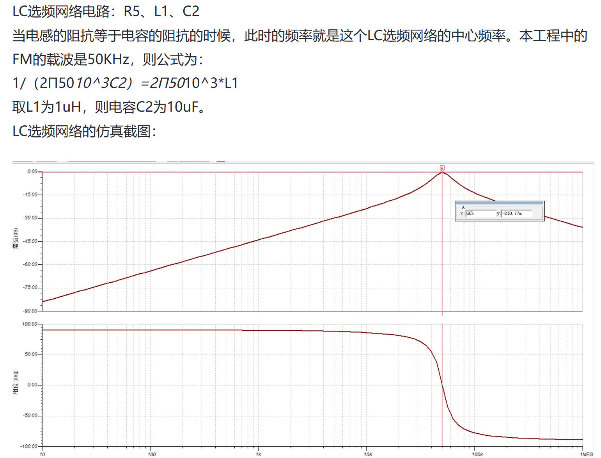
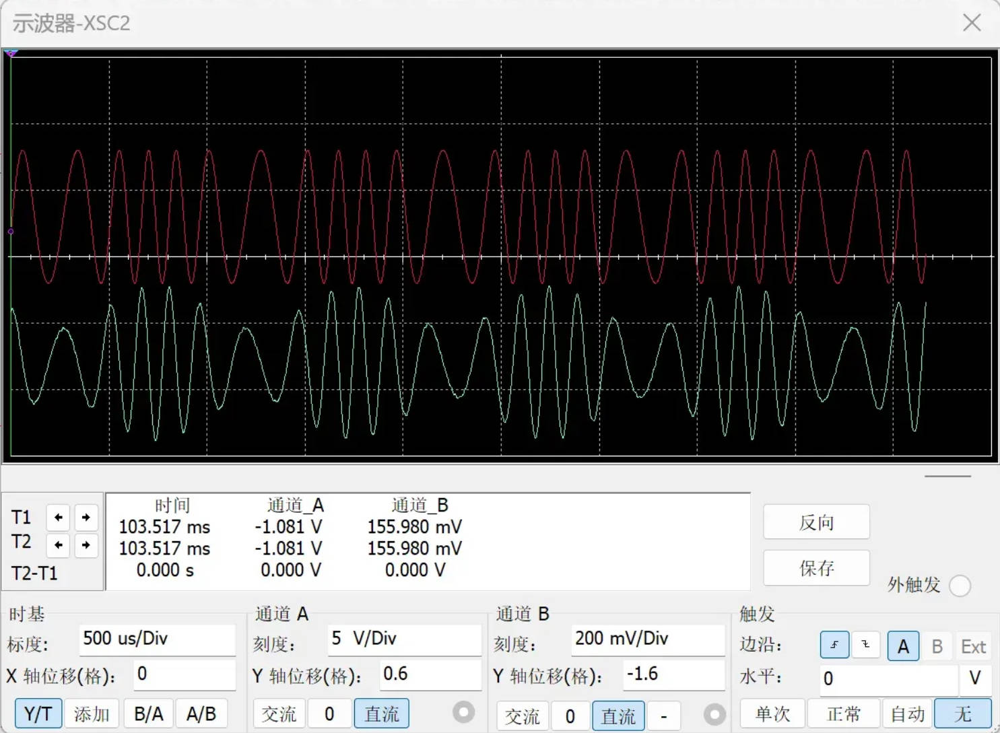

[TOC]

# FM（频率调制）核心知识总结

## FM调制原理
FM（Frequency Modulation）是 **频率调制** 的简称，核心是：**载波的瞬时频率随基带信号的幅度变化而线性变化，载波的幅度保持恒定**（与AM的幅度调制本质区别）。

### 什么是频率调制

频率调制（Frequency Modulation, FM）是一种模拟调制技术，其核心在于利用基带信号（或称调制信号）的幅度变化来控制高频载波的瞬时频率。在FM系统中，信息并非通过改变载波的幅度来承载，而是通过精确调控其频率的瞬时偏移来实现。

一个未调制的载波可以表示为一个具有固定频率 $f_c$（或角频率 $\omega_c=2\pi f_c$）和固定幅度 $A$ 的正弦波。当引入基带信号 $m(t)$ 后，FM信号的瞬时角频率 $\omega(t)$ 不再是常数，而是与 $m(t)$ 成线性关系。具体来说，瞬时角频率的表达式为：

$\omega(t) = \omega_c + k_f \cdot m(t)$

其中 $k_f$ 是一个关键参数，称为**频率灵敏度**或调频灵敏度，其单位通常是 rad/(s·V)。这个参数定义了基带信号每单位电压变化所能引起的载波角频率的偏移量，是衡量调制器效率的核心指标。

当基带信号 $m(t)$ 的幅度为正时，瞬时频率会高于中心频率 $f_c$；反之，当 $m(t)$ 为负时，瞬时频率则低于 $f_c$；而当 $m(t)$ 为零时，载波频率恰好维持在中心频率 $f_c$ 上。这种调制方式确保了信息的完整映射，基带信号的每一个细微变化都能引起载波频率的相应波动，从而为后续的解调过程提供了丰富的信息基础。

### 核心物理逻辑
- 载波基础：未调制时的载波（中心频率）为 $f_c$（角频率 $\omega_c = 2\pi f_c$），幅度固定为 $A$；
- 调制规律：基带信号 $m(t)$ 控制载波频率——$m(t)$ 增大时，载波瞬时频率高于 $f_c$；$m(t)$ 减小时，载波瞬时频率低于 $f_c$；$m(t)=0$ 时，载波频率保持 $f_c$；
- 关键特征：FM信号的幅度始终不变，仅频率随基带信号波动，抗干扰能力强（幅度干扰可通过限幅器抑制）。

### 2. 数学表达式推导
#### 瞬时角频率
设基带信号为 $m(t)$，则FM信号的 **瞬时角频率** 为：  
$$ \omega(t) = \omega_c + k_f \cdot m(t) $$  
- 符号说明：  
  - $\omega_c = 2\pi f_c$：载波中心角频率；  
  - **$k_f$：频率灵敏度（单位：rad/(s·V)），由调制电路决定，反映“基带信号单位幅度变化引起的角频率变化量”；**  
  - $m(t)$：基带信号（如语音信号，幅度范围通常为 $[-V_m, V_m]$​）。

这个公式是FM调制的基石。其中，

- $\omega_c = 2\pi f_c$ 是载波的中心角频率，代表了未调制时的频率。
- $k_f$ 是**频率灵敏度**，它决定了调制的深度和效率，**其物理意义是单位调制电压引起的角频率偏移量** 。
- $m(t)$ 是随时间变化的基带信号，例如音频信号。

这个公式清晰地表明，FM信号的瞬时频率在中心频率 $f_c$ 的基础上，围绕其上下波动，**波动的幅度和方向完全由基带信号 $m(t)$ 的瞬时值决定。**

例如，如果 $m(t)$ 是一个正弦波，那么瞬时频率也将呈现正弦波形式的周期性变化。这个数学关系为后续推导FM信号的完整时域表达式提供了最直接的出发点。

#### 瞬时相位

在定义了瞬时角频率之后，下一步是推导出FM信号的瞬时相位 $\phi(t)$。根据信号与系统的基本理论，瞬时角频率是瞬时相位对时间的导数，即 $\omega(t) = \frac{d\phi(t)}{dt}$。因此，要得到瞬时相位，我们需要对瞬时角频率进行积分。

角频率是相位的时间导数（$\omega(t) = \frac{d\phi(t)}{dt}$），因此 **瞬时相位** 为： 

$$ \phi(t) = \int_{0}^{t} \omega(\tau) d\tau = \omega_c t + k_f \int_{0}^{t} m(\tau) d\tau $$  

#### FM调制信号完整表达式
有了瞬时相位的表达式，我们就可以构建出FM信号在时域中的完整数学表达式。一个正弦波信号的一般形式是 $s(t) = A \cos[\phi(t)]$，其中 $A$ 是恒定的幅度，$\phi(t)$ 是瞬时相位。将上一步推导出的瞬时相位代入，我们得到FM信号的通用表达式：

$$ s_{\text{FM}}(t) = A \cdot \cos\left[ \omega_c t + k_f \int_{0}^{t} m(\tau) d\tau \right] $$

这个公式精确地描述了FM信号在任意时刻 $t$ 的波形。它清晰地展示了FM信号的三个核心特征：

- 恒定的幅度 $A$
- 作为载波的线性相位项 $\omega_c t$
- 以及包含调制信息的积分项 $k_f \int m(\tau) d\tau$

为了更具体地理解，我们可以考虑一个常见的测试场景，即基带信号为单频正弦波的情况。

设 $m(t) = V_m \cos(\omega_m t)$，其中 $V_m$ 是基带信号的幅度，$\omega_m = 2\pi f_m$ 是其角频率。将其代入通用表达式，积分项变为：

$$ k_f \int_{0}^{t} V_m \cos(\omega_m \tau) d\tau = \frac{k_f V_m}{\omega_m} \sin(\omega_m t) $$

因此，对于单频基带信号，FM信号的表达式可以简化为：

$$ s_{\text{FM}}(t) = A \cdot \cos\left[ \omega_c t + \beta_f \sin(\omega_m t) \right] $$

其中，$\beta_f = \frac{k_f V_m}{\omega_m}$ 被定义为FM调制系数，它将在下一节中详细讨论。这个简化形式在工程分析和仿真中非常有用，因为它将复杂的积分运算转化为了一个更易于处理的正弦函数。

## FM调制系数（$\beta_f$）的计算
### 调制系数（βf）的物理意义与公式

FM调制系数，也称为**频偏比**（$\beta_f$），是一个无量纲的参数，它更深刻地揭示了FM调制的本质。调制系数定义为最大频偏 $\Delta f_{\text{max}}$ 与基带信号（要传输的信号）最高频率 $f_m$ 的比值：

$$ \beta_f = \frac{\Delta f_{\text{max}}}{f_m} $$

这个比值综合了调制深度（由 $\Delta f_{\text{max}}$ 体现）和基带信号的特性（由 $f_m$ 体现）。将最大频偏的公式代入，可以得到调制系数的另一种表达形式，特别是在单频基带信号 $m(t) = V_m \cos(\omega_m t)$ 的情况下：

$$ \beta_f = \frac{k_f V_m}{2\pi f_m} = \frac{k_f V_m}{\omega_m} $$

这个公式表明，调制系数不仅与调制器的灵敏度 $k_f$ 和基带信号的幅度 $V_m$ 有关，还与基带信号的频率 $f_m$ 成反比。这意味着，对于同一个调制器和同一个基带信号幅度，频率越高的基带信号分量，其对应的调制系数越小。调制系数是判断FM信号频谱特性的核心依据。它直接决定了FM信号中边频分量的数量和幅度，进而决定了信号的有效带宽。在工程实践中，$\beta_f$ 是一个比 $\Delta f_{\text{max}}$ 更具指导意义的参数，因为它将调制深度与信号带宽直接关联起来，为系统设计和性能分析提供了便利。

### 定义与核心参数
#### 最大频偏（$\Delta f_{\text{max}}$）
基带信号 $m(t)$ 引起的载波频率最大偏移量，即：  
$$ \Delta f_{\text{max}} = \frac{1}{2\pi} \cdot \max\left[ k_f \cdot m(t) \right] = \frac{k_f \cdot |m(t)|_{\text{max}}}{2\pi} $$  
- 物理意义：载波频率偏离中心频率 $f_c$ 的最大范围，例如 $\Delta f_{\text{max}}=75kHz$ 表示载波频率在 $f_c-75kHz$ 到 $f_c+75kHz$ 之间波动；  
- 若 $m(t) = V_m \cos(\omega_m t)$，则 $|m(t)|_{\text{max}}=V_m$，因此 $\Delta f_{\text{max}} = \frac{k_f V_m}{2\pi}$。

#### 调制系数（$\beta_f$）的计算公式
FM调制系数是 **最大频偏（在频域当中，距离中心频率的偏移）与基带信号最高频率的比值**，即：  
$$ \beta_f = \frac{\Delta f_{\text{max}}}{f_m} $$  

- 符号说明：$f_m$ 是基带信号的最高频率（如语音信号 $f_m \approx 3kHz$）；  

- 结合单频基带信号的 $\Delta f_{\text{max}}$，可推导： ($V_m$ 是被调制信号的最大值-基带信号$\omega_m$ 是最大角频偏)

  $$ \beta_f = \frac{k_f V_m}{2\pi f_m} = \frac{k_f V_m}{\omega_m} $$  

### 物理意义与取值范围
- $\beta_f$ 是无量纲参数，反映调制深度：  
  - $\beta_f \ll 1$（如 $\beta_f < 0.5$）：窄带FM（NBFM），频谱近似与AM类似，带宽窄，多用于通信；  
  - $\beta_f \gg 1$（如 $\beta_f = 5\sim10$）：宽带FM（WBFM），频谱展宽，抗干扰能力强，多用于广播（如FM收音机 $\beta_f \approx 5$，$\Delta f_{\text{max}}=75kHz$，$f_m=15kHz$）；  
- 取值范围：$\beta_f > 0$​，无理论上限（由调制电路的频率调节范围决定）。

**窄带FM (NBFM)** ：当调制系数 $\beta_f$ 远小于1时（通常定义为 $\beta_f < 0.5$），我们称之为窄带FM。在这种情况下，FM信号的频谱结构与AM信号非常相似，主要由载波频率和一对上下边带组成，其带宽近似为 $2f_m$​。NBFM的主要优点是占用带宽窄，频谱效率高，因此常用于对带宽要求苛刻的通信系统，如双向无线电对讲机、警用通信、以及一些低速率的数据传输系统。在这些应用中，虽然音质和抗噪性不如WBFM，但其高效的频谱利用率是关键。

**宽带FM (WBFM)** ：当调制系数 $\beta_f$ 远大于1时（通常定义为 $\beta_f > 1$，在广播中常为5到10），我们称之为宽带FM。WBFM信号的频谱非常宽，包含大量的边频分量，其带宽远大于基带信号的最高频率。根据卡森带宽规则，WBFM的带宽近似为 $2(\Delta f_{\text{max}} + f_m)$。WBFM的主要优点是抗噪声和干扰能力极强，能够提供非常高的保真度。这是因为大的频偏使得信号能量分散在更宽的频带上，从而降低了单位带宽内的噪声功率。因此，WBFM被广泛应用于高保真音频广播（如FM广播电台，其标准频偏为75kHz）、电视伴音、以及高质量的音乐传输等场景。

### 示例计算
为了更好地理解调制系数的计算和应用，我们来看一个具体的例子。假设我们有一个基带信号 $m(t) = 2\cos(2\pi \times 3000t)$，其幅度 $V_m = 2V$，频率 $f_m = 3kHz$。我们使用的调制器频率灵敏度为 $k_f = 2\pi \times 10^5$ rad/(s·V)。

首先，我们计算最大频偏 $\Delta f_{\text{max}}$：
$$ \Delta f_{\text{max}} = \frac{k_f \cdot |m(t)|_{\text{max}}}{2\pi} = \frac{(2\pi \times 10^5) \times 2}{2\pi} = 2 \times 10^5 \text{ Hz} = 200 \text{ kHz} $$

这个结果表明，载波频率将在中心频率的基础上，根据基带信号的幅度，在 $\pm 200kHz$ 的范围内变化。

接下来，我们计算调制系数 $\beta_f$：
$$ \beta_f = \frac{\Delta f_{\text{max}}}{f_m} = \frac{200 \text{ kHz}}{3 \text{ kHz}} \approx 66.7 $$

计算得到的调制系数 $\beta_f \approx 66.7$ 远大于1，因此这是一个典型的**宽带FM（WBFM）** 信号。如此大的调制指数意味着该FM信号具有非常强的抗噪声能力，但同时也会占用非常宽的频谱。根据卡森带宽规则，其近似带宽为 $B \approx 2(\Delta f_{\text{max}} + f_m) = 2(200kHz + 3kHz) = 406kHz$。这个例子清晰地展示了调制系数如何量化调制深度，并帮助我们判断信号的频谱特性和适用场景。

## FM核心公式汇总表
| 物理量                | 公式                                                                 | 说明                                                                 |
|-----------------------|----------------------------------------------------------------------|----------------------------------------------------------------------|
| FM瞬时角频率          | $\omega(t) = \omega_c + k_f \cdot m(t)$                              | 随基带信号线性变化                                                   |
| FM调制信号（通用）    | $s_{\text{FM}}(t) = A\cos\left[ \omega_c t + k_f \int_{0}^{t} m(\tau)d\tau \right]$ | 幅度恒定，相位含积分项                                               |
| FM调制信号（单频基带）| $s_{\text{FM}}(t) = A\cos\left[ \omega_c t + \beta_f \sin(\omega_m t) \right]$ | $m(t)=V_m\cos(\omega_m t)$ 时的简化形式                              |
| 最大频偏              | $\Delta f_{\text{max}} = \frac{k_f \cdot |m(t)|_{\text{max}}}{2\pi}$  | 载波频率偏离中心频率的最大值                                         |
| FM调制系数            | $\beta_f = \frac{\Delta f_{\text{max}}}{f_m}$                         | 调制深度指标，无量纲                                                 |

# FM系统关键性能指标与工程实践

## 对幅度噪声的抑制原理

FM系统最显著的优势之一是其对幅度噪声（AM噪声）的卓越抑制能力。这一特性源于FM信号的**恒包络**本质。在FM调制中，信息被编码在载波的频率变化中，而其幅度 $A$ 始终保持恒定。在信号传输过程中，信道引入的绝大多数干扰（如热噪声、大气噪声、电磁干扰）主要表现为对信号幅度的随机调制。在FM接收机中，解调过程的第一步通常是**限幅**。限幅器是一个非线性电路，其功能是将输入信号的幅度“削平”，无论输入信号的幅度如何波动，其输出信号的幅度都被限制在一个固定的电平。这个过程可以有效地去除所有叠加在FM信号上的幅度噪声，而信号中携带的频率信息则完好无损。因此，经过限幅器后，信号的信噪比得到了极大的改善。相比之下，AM系统对幅度噪声非常敏感，因为AM信号的信息本身就承载在幅度上，任何幅度上的干扰都会直接转化为解调输出中的噪声，导致信噪比下降。

## 信噪比（SNR）与调制指数的关系

在理想的FM解调器中，输出信噪比（SNR）与输入信噪比之间存在一个非线性的关系，这个关系由**调制指数 $\beta_f$** 决定。当输入信噪比高于门限值时，FM解调器的输出信噪比可以表示为：

$$
\text{SNR}_{\text{out}} \approx 3 \beta_f^2 (\beta_f + 1) \cdot \text{SNR}_{\text{in}}
$$

这个公式表明，**输出信噪比与调制指数 $\beta_f$ 的立方成正比**。这意味着，通过增加调制指数（即增大频偏），可以显著提高解调输出的信噪比。这种现象被称为 **“FM改善因子”** 或 **“FM增益”** 。其物理意义在于，大的频偏使得信号的频率变化范围更宽，解调器能够更容易地将频率的微小变化与噪声区分开来。频率的微小变化在解调后会产生较大的电压变化，而噪声则没有这种放大效应。因此，在带宽允许的情况下，选择较大的调制指数是提高FM系统抗噪声性能的有效手段。这也是为什么高保真FM广播（如 $\beta_f \approx 5$）比窄带FM通信（如 $\beta_f < 0.5$）具有更好音质和更强抗干扰能力的原因。

##  门限效应与改善方法

尽管FM系统具有优异的抗噪声性能，但它也存在一个固有的缺点，即**门限效应（Threshold Effect）** 。门限效应是指当输入信噪比（SNR）降低到一个特定的临界值（称为**门限**）时，解调输出的信噪比会急剧恶化，不再是线性关系。当输入信噪比高于门限时，输出信噪比随着输入信噪比的改善而线性增加（并受到FM增益的放大）。然而，一旦输入信噪比低于门限，输出信噪比会迅速下降，通信质量变得很差。

门限效应的产生是由于在极低信噪比条件下，噪声的幅度变得与信号幅度相当，甚至超过信号幅度。此时，噪声会引起信号相位的剧烈随机跳变，这种现象称为“相位滑移”或“周跳”。这些随机的相位跳变在解调后会产生大量的脉冲噪声，严重污染了输出信号，导致信噪比急剧下降。

改善门限效应的方法主要有：

1.  **提高输入信噪比**：这是最根本的方法，可以通过提高发射功率、使用高增益天线、降低接收机噪声系数等方式实现。
2.  **采用预加重和去加重技术**：在发射端对高频分量进行预加重（放大），在接收端进行相应的去加重（衰减）。这可以在不增加总功率的情况下，提高高频部分的信噪比，从而改善整体的输出信噪比。
3.  **使用锁相环（PLL）解调器**：相比于传统的鉴频器，PLL解调器具有更低的门限值。这是因为PLL的窄带跟踪特性使其能够更好地抑制噪声，并且在一定程度上抵抗相位滑移的发生。
4.  **采用频率调制负反馈（FMFB）解调器**：这是一种更复杂的解调技术，通过引入一个负反馈环路来压缩FM信号的频偏，从而降低解调器输入端的等效噪声带宽，有效降低门限。

# FM解调方式总结

## 波形变换鉴频（FM->FM-AM）

[《高频电子线路》—— 鉴频方法_鉴频器-CSDN博客](https://blog.csdn.net/2301_79288228/article/details/143523454)——写的太好了

### 斜率鉴频和比例鉴频

- RL鉴频器转AM
- LC鉴频转AM
- 微分器

[利用锁相环进行调频解调|带宽|电路|电压_新浪科技_新浪网](https://finance.sina.com.cn/tech/roll/2025-11-07/doc-infwqerv2535913.shtml)

#### 斜率鉴频——**LC选频网络**

鉴频法最经典的实现方式是利用线性谐振回路（如LC并联或串联回路）的幅频特性曲线。一个理想的谐振回路在其谐振频率点 `f0` 处输出幅度最大，当输入信号频率偏离 `f0` 时，输出幅度会随之下降，形成一个以 **`f0` 为中心的对称曲线。**

为了实现线性鉴频，FM信号的中心频率 `fc` 并不设置在谐振回路的谐振频率 `f0` 上，而是故意将其设置在幅频特性曲线的某一侧斜坡上。这样，当FM信号的瞬时频率随着基带信号 `m(t)` 的变化而在 `fc` 附近波动时，其对应的输出幅度也会沿着这个斜坡线性变化。

例如，**当瞬时频率升高时，输出幅度会相应增大**（或减小，取决于工作在哪一侧斜坡）；**反之，当瞬时频率降低时，输出幅度则会减小（或增大）**。通过这种方式，频率的变化就被线性地转换成了幅度的变化。这种利用幅频特性曲线斜率进行鉴频的方法被称为 **“斜率鉴频法”** 。其关键在于找到一个足够线性的工作区域，以保证解调输出的失真最小。然而，实际的谐振回路幅频特性曲线在远离 `f0` 的区域会呈现出明显的非线性，这限制了斜率鉴频法的线性工作范围和动态范围。

这样就转化为一个类AM波了

[基于 LC 选频网络的 FM 解调 - 嘉立创EDA开源硬件平台](https://oshwhub.com/article/fm-demodulation-based-on-lc-frequency-selection-network)

#### 比例鉴频——微分器鉴频数学原理

从数学角度看，鉴频法可以通过对FM信号进行微分来实现。标准的FM信号表达式为：

$$ s_{\text{FM}}(t) = A \cos\left[ \omega_c t + k_f \int_{0}^{t} m(\tau) d\tau \right] $$

对该信号求时间导数，得到：

$$ \frac{ds_{\text{FM}}(t)}{dt} = -A \left[ \omega_c + k_f m(t) \right] \sin\left[ \omega_c t + k_f \int_{0}^{t} m(\tau) d\tau \right] $$
这个表达式可以被重新写成一个标准的AM信号形式。令，$$\theta(t) = \omega_c t + k_f \int_{0}^{t} m(\tau) d\tau$$则上式变为：

$$ \frac{ds_{\text{FM}}(t)}{dt} = A \left[ \omega_c + k_f m(t) \right] \sin\left[ \theta(t) - \frac{\pi}{2} \right] $$​​​​

在这里，信号的包络（幅度）是 $$A\left[ \omega_c + k_f m(t) \right]$$，它直接与基带信号 $$m(t)$$ 成线性关系。而信号的相位部分 $$\sin\left[ \theta(t) - \frac{\pi}{2} \right]$$ 仍然保留了FM的特性。因此，经过微分器后，原始的FM波被转换成了一个幅度和频率都随 $$m(t)$$ 变化的调幅-调频（AM-FM）波。

接下来的任务就是从这样一个复合调制信号中提取出幅度信息。这可以通过一个包络检波器来完成，它通常由一个二极管和一个RC低通滤波器组成。二极管负责整流（半波或全波），将信号的负半周翻转到正半周，形成一个脉动的直流信号。然后，RC低通滤波器滤除高频的载波分量，保留低频的包络变化，最终得到与 $$m(t)$$ 成正比的输出电压。

这个过程的数学本质就是取信号的绝对值（或半波整流）后进行低通滤波，从而恢复出原始的调制信号。

### 鉴频法核心性能与特性
**鉴频法的核心性能指标是频率-幅度转换的线性度**，直接决定解调输出的失真程度，不同实现方式的线性度差异显著。

#### 斜率鉴频法局限
- **线性度局限**：线性度完全依赖谐振回路幅频特性的线性区域，而该区域通常较窄，导致**线性工作带宽有限**，不适用大频偏的宽带FM信号；频率偏移超出线性区时，会产生严重非线性失真。
- **抗干扰能力弱**：FM信号上叠加的幅度噪声会直接通过包络检波器输出，虽可通过限幅器消除幅度噪声，但会增加电路复杂性。

#### 微分鉴频法特性
- **理论优势**：微分操作本身具有线性特性，理论线性度优于斜率鉴频法。
- **实际局限**：实际微分器（如RC高通网络）幅频特性非完全线性，仍会引入一定失真。

**鉴频灵敏度**（单位频率变化对应的输出电压变化量）直接决定解调输出的信噪比，是衡量鉴频性能的重要补充指标。

## 相移乘法鉴频（FM→FM-PM）

### 相位鉴频核心逻辑：频率-相位-幅度的转换
相位鉴频法是一类重要的FM解调技术，其核心思想是设计对频率变化敏感的相频特性网络，先将频率变化转换为相位变化，再将相位变化转换为幅度变化，最终通过检波或滤波提取与原始基带信号相关的信息，实现解调。

### 核心框架：两次线性转换
相位鉴频的核心目标是建立“Δf→ΔV”的线性映射关系，相移乘法鉴频是这一框架的典型工程落地，通过两步关键转换实现：
1. **第一步：频率→相位的线性转换（Δf→Δφ）**  
   利用相频特性敏感的网络，将FM信号的瞬时频率偏移Δf（由基带信号m(t)决定）转换为可量化的相位差Δφ。这是相位鉴频区别于斜率鉴频的核心环节，也是相移乘法鉴频中“FM→FM-PM”转换的核心依据。
2. **第二步：相位→幅度的线性转换（Δφ→ΔV）**  
   通过矢量叠加或乘法器相位比较，将相位差Δφ转换为合成信号的幅度变化，再经检波或滤波提取幅度信息，最终得到与Δf成正比的输出电压ΔV，完成解调。

💡 核心关系链：$m(t) \propto \Delta f(t) \propto \Delta \phi(t) \propto \Delta V(t)$，两次转换的线性度直接决定解调性能。

### 关键环节一：频率→相位转换的实现（Δf→Δφ）
该环节的核心是构造“频率-相位记忆”网络，使相位差与频率偏移呈严格线性关系，主流实现方式为**耦合谐振回路**（变压器或LC耦合网络），也是相移乘法鉴频中FM-PM转换的核心载体。

#### 核心设计要求与物理机制
设计目标：使相位差Δφ与角频率偏移Δω（$\Delta \omega=2\pi\Delta f$）满足线性关系$\Delta \phi = k·\Delta \omega$（k为比例常数），通过以下两步实现：
- **中心频率预设相移**：在回路谐振频率$\omega_c$处，通过耦合方式（如互感极性）预设固定相移$\phi_0=\pi/2$（90°），确保工作点位于相频特性的线性区。
- **频偏后的总相移**：当输入FM信号的瞬时角频率为$\omega=\omega_c+\Delta \omega$时，回路产生的附加相移与$\Delta \omega$线性相关，总相移为：  
  $\theta(\omega) = \frac{\pi}{2} + k·\Delta \omega$  
  此时，FM信号的频率变化被完整映射为相位变化，经过该网络的信号成为“调频-调相波（FM-PM波）”，完成相移乘法鉴频的关键前置转换。

#### 耦合谐振回路的工作特性
以变压器耦合回路为例，其相位差随输入频率的变化规律如下：
- 当$\omega=\omega_c$时：次级电压与初级电压呈预设的90°相移（正交）；
- 当$\omega>\omega_c$或$\omega<\omega_c$时：相位差随频偏$\Delta f$线性增大或减小；
- 通过优化互感系数、回路Q值等参数，可在FM信号的最大频偏范围内（$\pm\Delta f_{max}$）保证相位差与$\Delta f$的线性度误差<1%。

### 关键环节二：相位→幅度转换的两种实现路径（Δφ→ΔV）
该环节将FM-PM波的相位差信息转换为幅度变化，根据电路复杂度分为两种路径，后者为相移乘法鉴频的核心实现方式。

#### 路径A：矢量叠加+差分检波（分立元件方案）
通过原始FM信号（参考信号）与FM-PM波（相移信号）的矢量叠加，使合成信号幅度反映相位差，再通过差分检波消除非线性。

#####  信号叠加原理
设两路信号幅度相等（工程中通过匹配确保A=B）：
- 参考信号：$V_1(t) = A·\cos[\omega t + \phi(t)]$（$\phi(t)$为FM信号固有相位）；
- 相移信号（FM-PM波）：$V_2(t) = A·\cos[\omega t + \phi(t) + \theta(\omega)]$（$\theta(\omega)$为频率相关相移）；
- 合成信号：$V_{sum}(t) = V_1(t) + V_2(t)$，利用三角恒等式化简为：  
  $V_{sum}(t) = R·\cos[\omega t + \phi(t) + \alpha]$  
  其中合成幅度R为：  
  $R = \sqrt{A^2 + A^2 + 2A^2·\cos\theta(\omega)} = A·\sqrt{2(1+\cos\theta(\omega))}$

##### 非线性问题与差分改进
代入$\theta(\omega)=\frac{\pi}{2} + k\Delta \omega$，得$R = A·\sqrt{2(1 - \sin(k\Delta \omega))}$，小频偏下$\sin(k\Delta \omega)\approx k\Delta \omega$，R与$\Delta \omega$呈非线性关系。工程中通过“差分检波”优化：
同时对$V_1+V_2$和$V_1-V_2$进行包络检波，输出两路检波电压的差值：
$V_{out} \propto \cos\theta(\omega) = -\sin(k\Delta \omega) \approx -k\Delta \omega$，此时输出与$\Delta f$线性相关，解决非线性问题。

####  路径B：乘法器+低通滤波（相移乘法鉴频核心方案）
该路径是相位鉴频的高性能实现形式，通过乘法器直接处理相位关系，线性度和灵敏度显著优于路径A。

#####  核心原理：乘法器的相位比较作用
将参考信号$V_1(t)$与FM-PM波$V_2(t)$输入乘法器，利用三角函数积化和差特性，乘法器输出为：
$V_{mul}(t) = V_1(t)·V_2(t) = \frac{A^2}{2}\{\cos[2\omega t + 2\phi(t) + \theta(\omega)] + \cos\theta(\omega)\}$
其中包含$2\omega$的高频载波分量和$\cos\theta(\omega)$的低频相位信息分量。

##### 线性解调的实现
通过低通滤波器滤除$2\omega$高频分量，仅保留低频分量：
$V_{out}(t) = \frac{A^2}{2}·\cos\theta(\omega)$
代入$\theta(\omega)=\frac{\pi}{2} + k\Delta \omega$，得$V_{out} = -\frac{A^2}{2}·\sin(k\Delta \omega)$。小频偏下$\sin(k\Delta \omega)\approx k\Delta \omega$，且$\Delta \omega=2\pi\Delta f\propto m(t)$，最终输出：
$V_{out} \approx -\frac{A^2}{2}·k·2\pi\Delta f = K_d·\Delta f \propto m(t)$
其中$K_d=-\pi A^2k$为鉴频灵敏度（常数），实现$\Delta f$到$\Delta V$的完美线性转换。

📌 相移乘法鉴频的命名由来：先通过相移网络将FM转换为FM-PM波，再通过乘法器实现相位-幅度转换，核心特征与该路径完全匹配。

### 数学推导：相位差与输出电压的关系
假设输入的FM信号为$V_{in}(t) = A \cos(\omega t + \phi(t))$（$\phi(t)$为由基带信号$m(t)$引起的相位变化），该信号被分为两路：
- 参考信号：$V_{ref}(t) = A \cos(\omega t + \phi(t))$；
- 相移信号：$V_{shift}(t) = B \cos(\omega t + \phi(t) + \theta(\omega))$（$\theta(\omega)$为相移网络产生的频率相关相移）。

两路信号叠加得到合成信号$V_{sum}(t)$：
$$ V_{\text{sum}}(t) = V_{\text{ref}}(t) + V_{\text{shift}}(t) = A \cos(\omega t + \phi(t)) + B \cos(\omega t + \phi(t) + \theta(\omega)) $$
利用三角恒等式化简为：
$$ V_{\text{sum}}(t) = R \cos(\omega t + \phi(t) + \alpha) $$
其中合成信号的幅度$R$为：
$$ R = \sqrt{A^2 + B^2 + 2AB \cos(\theta(\omega))} $$

合成幅度$R$直接取决于相位差$\theta(\omega)$，而$\theta(\omega)$与频率$\omega$线性相关（$\theta(\omega) \approx k \cdot \Delta \omega$），因此$R$随频率变化。小角度下$\cos(\theta(\omega)) \approx 1 - \frac{(\theta(\omega))^2}{2}$，$R$与$\Delta \omega$呈非线性关系，需通过乘积型鉴频器（乘法器+低通滤波）优化，最终得到与$\theta(\omega)$或$\Delta \omega$成正比的线性输出。

## 脉冲计数鉴频

## 正交相干解调

# 模块解调（待完善）

## 锁相环解调

### cd4051锁相环

### NE564

## 模块解调

### 8025（108M）高载频