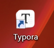
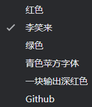
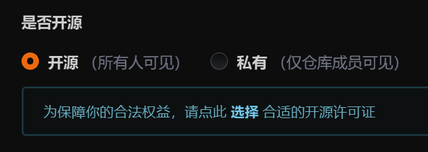
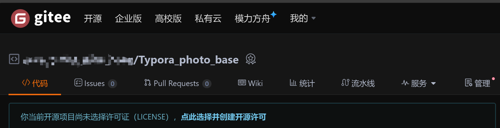
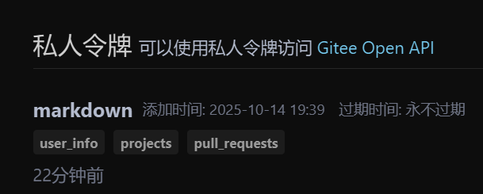
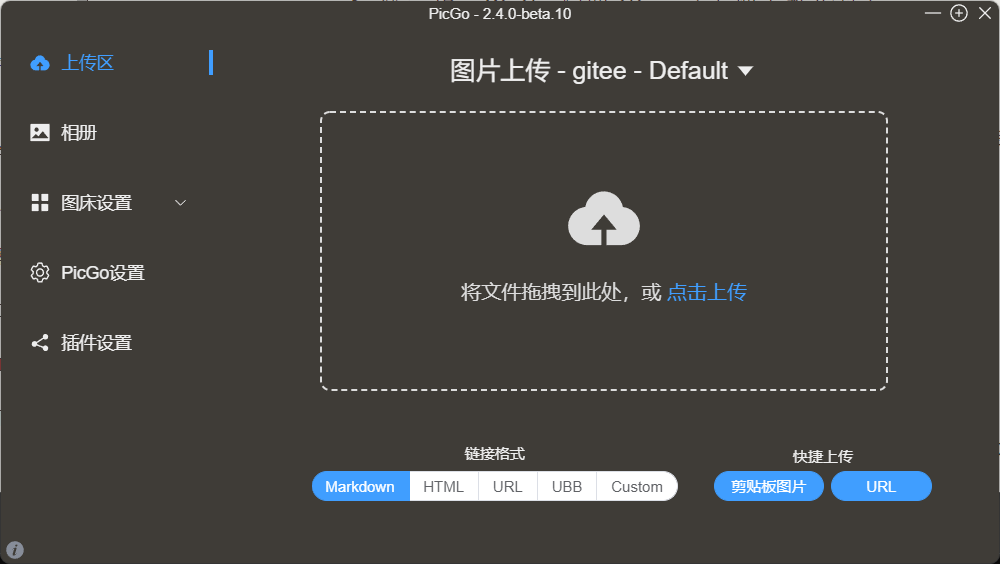
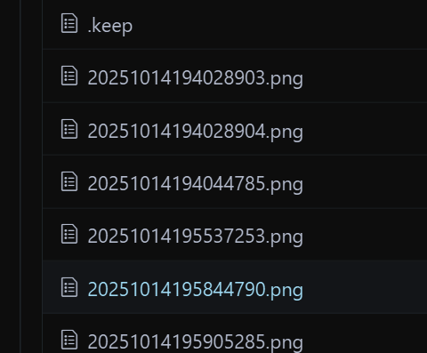
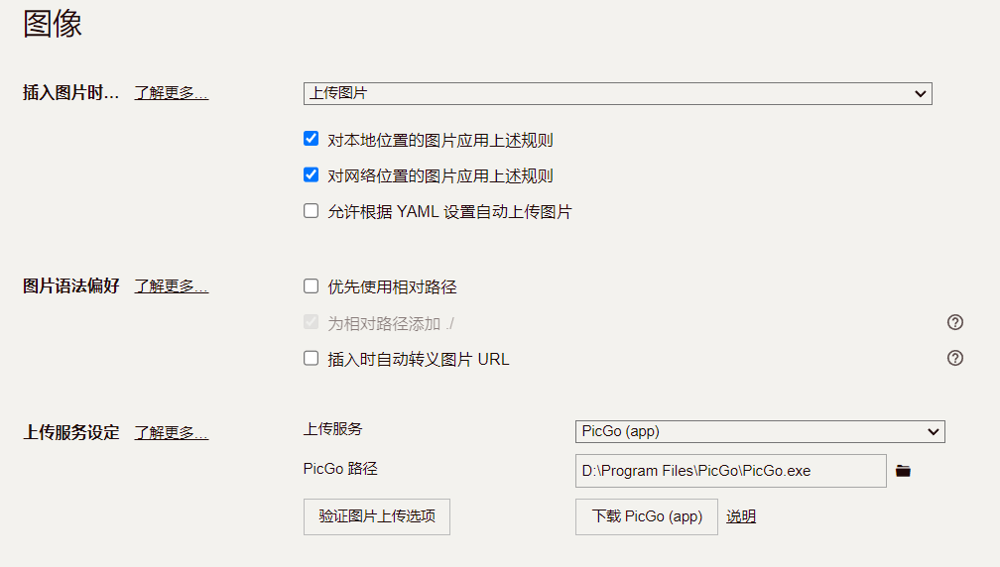
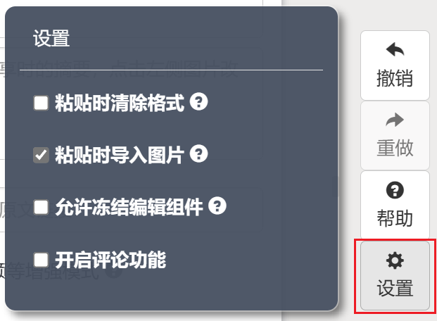
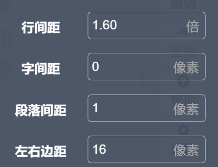

# 用 **Typora （CSS）**+ **秀米** + **PicGo** 玩转公众号编辑

## 一、为什么说传统秀米该升级了？【用秀米的原因是学院发微信公众必须用秀米】

记得大一刚做公众号（~~**当牛马**~~）时，整天泡在秀米里拖拖拽拽排版，光调一个图片位置就能折腾半小时 ——

- 文字和图片分开编辑，改完文字还要重新对齐图片
- 样式模板虽多，但换个主题就得全部重做
- 复制到公众号后台经常格式错乱，还得手动修图链接
- 没有本地备份，万一账号出问题内容全没了

后来发现了 **Typora+PicGo + 秀米** 的黄金组合，现在写文效率直接翻倍！今天就把这套 **亲测有效** 的流程分享。

## 二、三件套工具快速入门

### 1. Typora：Markdown 写作神器（学长的「码字主战场」）

#### ▶ 啥是 Typora？

简单说就是「能实时预览的 Markdown 编辑器」，不用记复杂代码，打个 `#` 就是标题，敲 `-` 就是列表，写文时就像在 Word 里一样直观，但排版效率高 10 倍！

#### ▶ 必学操作：

- 写标题：输入 `# 一级标题`，`## 二级标题`，最多到六级
- 插图片：直接拖图片进 Typora，后面会自动上传到云端
- 改样式：自定义 CSS 文件，比如设置行间距 1.8 倍，字体更适合手机阅读

### 2、啥是 CSS？用人话给你讲明白【建议不清楚的名词百度一下】

可能第一次听说「自定义 CSS」时一脸懵，其实这东西超简单 ——**CSS 就像给文章穿衣服的「造型师」**，能控制文字大小、颜色、间距这些视觉效果。在 Typora 里用 CSS，就像提前给文章化好妆，复制到公众号后几乎不用再调格式～

#### ▶ 为啥强烈推荐你用自定义 CSS？

1. **一次配置，永久复用**：把写好的 CSS 文件保存起来，以后新建文章直接套用，不用每次调格式

2. **提前预览最终效果**：在 Typora 里看到的样子，和公众号手机端几乎一致，减少后台调整时间

3. **打造个人风格**：比如把引用区块改成浅蓝底色，文末分割线换成波浪线，让读者一眼认出你的文章

   

#### ▶ 傻瓜式应用步骤（3 步搞定）：

1. 在 Typora 里点「文件」→「偏好设置」→「外观」→「打开主题文件夹」
2. 新建一个 `.css` 文件（比如 `wechat-style.css`），把上面的代码复制进去
3. 重启 Typora，在「主题」里选择「自定义样式」，搞定！

### 3. 秀米：专业排版收尾（最后美化的「化妆师」）

#### ▶ 秀米还用学？

别小看它！虽然直接用秀米写文麻烦，但用它做「最后一公里」排版超香 ——

- 套模板：选个好看的模板，一键应用到全文
- 调细节：给段落加边框、给标题加阴影，这些 Typora 不好实现的效果，秀米点一点就搞定
- 预览发布：直接复制到公众号后台，格式基本不会乱

### 4. PicGo+Gitee：图片云端管家（再也不怕图片失效）

#### ▶ 为什么选 Gitee？

我试过很多图床，Gitee 对新手最友好：

- 免费：仓库公开就能用，学生党零成本
- 稳定：国内访问快，比国外图床靠谱
- 简单：配置步骤少，不像阿里云要申请密钥啥的

## 三、保姆级配置教程：Gitee 图床这样搭

### ▶ 第一步：Gitee 创建图片仓库（5 分钟搞定）

1. 注册 Gitee 账号（就像注册 QQ 一样简单）

2. 点右上角「+」新建仓库，名字随便起（比如 `my-wechat-images`）

3. **关键步骤！** 仓库权限一定要选「开源」（不然图片别人看不到）

   

4. 记住仓库路径，格式是 `你的用户名/仓库名`（比如 `xiaoming/wechat-pics`）

   

### ▶ 第二步：生成访问令牌（重要！别泄露）

1. 点头像进「设置」→「私人令牌」→「生成新令牌」

   

2. 描述写「公众号图片上传」，勾选 `repo` 权限（只选这个就够）

3. 生成后 **立刻复制 Token** 保存到记事本（关闭页面就看不到了！）

### ▶ 第三步：PicGo 配置 Gitee（手把手教你填）

1. 下载安装 PicGo（搜「PicGo 官网」就行）

   

2. 打开「插件设置」，搜索安装 `gitee-uploader` 插件（可能要先装 Node.js，按提示装就行）

3. 进「图床设置」→「Gitee」，填这四个参数：
   - repo：填刚才的仓库路径（如 `xiaoming/wechat-pics`）
   - branch：默认 `master` 不动
   - token：粘贴刚才保存的 Token【生成的令牌！注意令牌就显示一次】
   - path：填 `images/`（图片存在仓库的 images 文件夹里，方便管理）

4. 点「设为默认图床」，然后点「上传区」拖张图测试，成功的话 Gitee 仓库里会出现图片

   

### ▶ 第四步：Typora 联动 PicGo（图片自动上传）

1. 打开 Typora，点「文件」→「偏好设置」→「图像」

2. 三个选项都勾选：
   - 插入图片时「上传图片」
   - 对本地 / 网络图片都应用规则

3. 上传服务选「PicGo」，浏览找到 PicGo 的安装路径（比如 `D:\Program Files\PicGo\PicGo.exe`）

4. 点「验证图片上传」，提示成功就 OK 啦～

   

## 四、高效工作流：我的的「三步成文法」

### ▶ 1. Typora 里疯狂码字（专注内容）

- 写文时不用管图片位置，直接拖进来就行（PicGo 会自动上传成链接）

- 用 Markdown 语法快速排版：

- 写完保存为 `.md` 文件，以后想改随时打开

​	

### ▶ 2. 秀米里美化排版（5 分钟变精致）

1. 在 Typora 全选复制文章，粘贴到秀米编辑器

   

   【一定要把清除格式这个选项删去！！！！】

2. 左边栏选「模板」，找个喜欢的风格一键套用（比如清新风、简约风）

3. 调整细节：
   - 给文字加字间距（手机看更舒服）
   - 给图片加圆角边框
   - 文末加公众号二维码（秀米里直接搜「二维码」组件）

4. 点「预览」看看手机效果，没问题就复制到公众号后台【可以加一些 svg，贴纸一类的，我不喜欢那么复杂的就省略了】

### ▶ 3. 云端管理永不丢失（学长的防丢秘籍）

- Gitee 仓库定期备份（右键仓库「克隆到本地」）
- Typora 文件存到云盘（比如 gitee/github，换电脑也能接着写）
- 秀米里把常用组件收藏（比如开头引导图、文末互动区），下次直接拖出来用

## 五、学长踩过的坑 & 解决方案

### ▶ 常见问题 1：图片上传失败，提示 401

- 原因 90% 是 Token 填错了！检查有没有多空格、少字母
- 解决：重新生成 Token，复制时别选中前后空格

### ▶ 常见问题 2：秀米粘贴后格式乱了

- 先把 Typora 内容粘贴到记事本（去掉多余格式），再复制到秀米
- 秀米里点「清除格式」，再重新套用模板

### ▶ 常见问题 3：公众号后台图片显示红叉

- 检查 Gitee 仓库是否是「开源」状态（私有仓库图片无法访问）
- 在秀米里右键图片「替换图片」，手动粘贴 Gitee 的图片链接

## 六、最后送学弟学妹们三个效率 Tips

1. **CSS 样式模板**：在 Typora 里自定义样式，比如设置「正文 16px，行高 1.8 倍」，写文时就能预览到接近公众号的效果，后台几乎不用调格式。

2. **快捷键封神**：
   - `Ctrl+B` 加粗，`Ctrl+I` 斜体，`Ctrl+T` 建表格
   - 记住这几个，排版速度翻倍

3. **多设备同步**：Typora 文件存到 GitHub 或 Gitee 仓库，用手机端 Markdown 软件（如 iA Writer）也能改，真正随时随地写文

4. 与两边的间距不对，改图片显示的参数就好了，左右边距，很快速的就写好一篇推送了！

   

## 七、焚决无敌

用优秀的 ai 提示词，直接写文本，后续直接稍微改一下就行。

## 结语

学弟学妹们刚开始可能觉得配置麻烦，但学长保证：花 1 小时搭好环境，以后每次写文能省 2 小时！再也不用为图片失效发愁，再也不用在秀米里反复调格式 ——**把时间花在写优质内容上，才是做公众号的核心**
