---

title: 电赛HAL库学习心得
slug: dian-hal
description: 枚举了自己学习hal库的一些模式配置，基于F407zet6
date: 2025-11-28T22:28:00+08:00
hidden: true
tags:
  - HAL
  - 电赛
  - hidden
---


# 整体理解

## STM32HAL库常用函数速查手册——[链接](https://www.cnblogs.com/startrack/p/16831402.html)

## HAL 库的结构理解

首先，你先得知道 STM32 推出 HAL 库的定位是什么，是给大家参考学习用？是闲着没事重新搞一套库？HAL 库本身的定位是 **[硬件抽象层](https://zhida.zhihu.com/search?content_id=712503208&content_type=Answer&match_order=1&q=硬件抽象层&zhida_source=entity)，** 硬件抽象层最核心的任务就是让你不懂硬件，也能操作芯片，让你换一个不同型号的 STM32 时，也不用重写底层代码。HAL 库提供的 **[回调函数](https://zhida.zhihu.com/search?content_id=712503208&content_type=Answer&match_order=1&q=回调函数&zhida_source=entity)（Callback）**，本质上和做填空题一样，你不需要关心硬件底层实现（比如清理中断标志位，处理一些基础的状态），你只需要关心中断发生之后，空位里你想填什么就行（比如说空闲中断，半满中断，全满中断等）。

举个栗子：假设你在用串口接收中断。在 51 上，你可能直接在中断函数里读 SBUF 寄存器，然后处理数据。但 HAL 库的套路是：

1. 硬件触发中断 → 2. 自动跳转到 HAL 库写好的 **[中断服务函数](https://zhida.zhihu.com/search?content_id=712503208&content_type=Answer&match_order=1&q=中断服务函数&zhida_source=entity)**（比如 `HAL_UART_IRQHandler`）→ 3. 这个库函数帮你检查是哪种中断（接收完成？发送完成？错误？）→ 4. 最后调用你提前写好的 **回调函数**（比如 `HAL_UART_RxCpltCallback`）让你处理具体业务逻辑。

**那为什么要绕这一圈？**

# 基础文件的配置

## HAL 库的基础文件配置


## HAL 库的串口配置

### 重新定向printf函数&scanf函数步骤

#### 打开或创建工程

打开或者创建自己要用到的工程，配置串口相关的GPIO、时钟、波特率等，本次使用STM32CubeMX创建工程，打开串口1，配置波特率为115200，数据位为8，停止位为1，无奇偶校验。

#### 记得添加MicroLib（其实不一定）

在KEIL勾选USE MicroLib

#### 方法1——比较稳

```C
//在main.h中添加串口结构体的定义
typedef struct                         // 声明一个结构体，方便管理变量
{
    uint16_t  ReceiveNum;              // 接收字节数; 在中断回调函数里被自动赋值; 只要字节数>0，即为接受到新一帧的数据
    uint8_t   ReceiveData[512];        // 接收到的数据
    uint8_t   BuffTemp[512];           // 接收缓存; 注意：这个数组，只是一个缓存，用于DMA逐个字节接收，当接收完一帧后，数据在回调函数中，会自动转存到 ReceivedData[ ] 存放。即：双缓冲，有效减少单缓冲的接收过程新数据覆盖旧数据
} xUATR_TypeDef;

// 声明串口的结构体; 为了方便使用，一次过全声明了
extern xUATR_TypeDef xUART1 ;          // 定义串口1的数据接收结构体，方便管理变量。也可以不用结构体，用单独的变量
extern xUATR_TypeDef xUART2 ;          // 定义串口2的数据接收结构体，方便管理变量。也可以不用结构体，用单独的变量
extern xUATR_TypeDef xUART3 ;          // 定义串口3的数据接收结构体，方便管理变量。也可以不用结构体，用单独的变量
extern xUATR_TypeDef xUART4 ;          // 定义串口4的数据接收结构体，方便管理变量。也可以不用结构体，用单独的变量
extern xUATR_TypeDef xUART5 ;          // 定义串口5的数据接收结构体，方便管理变量。也可以不用结构体，用单独的变量
extern xUATR_TypeDef xUART6 ;          // 定义串口6的数据接收结构体，方便管理变量。也可以不用结构体，用单独的变量
```

然后在uart.c中添加头文件

```c
#include "stdio.h"
#include <stdlib.h>
#include <stdarg.h>
```

在main函数中的使用方法就是

```C
HAL_UARTEx_ReceiveToIdle_DMA(&huart1, xUART1.BuffTemp, sizeof(xUART1.BuffTemp));    // 开启DMA+空闲中断接收; 配合回调函数使用
```

> 因为这个结构体中的ReceiveNum会在收到数据后发生变化，所以可以通过if (xUART1.ReceiveNum)来判断是否接收到数据，通过xUART1.ReceiveNum = 0;来清0接收标记

然后需要添加下面的代码来实现printf的重定向

```C
/******************************************************************************
 * 功  能： printf函数支持代码
 * 说  明： 加入以下代码, 使用printf函数时, 不再需要选择use MicroLIB
 *          复制本函数到你的工程，即可使用
 * 参  数：
 * 返回值：
 * 备  注： 最后修改_2020年07月15日
 ******************************************************************************/
#include <stdio.h>
#pragma import(__use_no_semihosting)

struct __FILE
{
    int handle;
};                                                         // 标准库需要的支持函数

FILE __stdout;                                             // FILE 在stdio.h文件
void _sys_exit(int x)
{
    x = x;                                                 // 定义_sys_exit()以避免使用半主机模式
}

int fputc(int ch, FILE *f)                                 // 重写fputc函数，使printf的输出由UART1实现,  这里使用USART1
{
    // 注意，不能使用HAL_UART_Transmit_IT(), 机制上会冲突; 因为调用中断发送函数后，如果上次发送还在进行，就会直接返回！它不会继续等待，也不会数据填入队列排队发送
    HAL_UART_Transmit(&huart1, (uint8_t *)&ch, 1, 0x02);   // 使用HAL_UART_Transmit，相等于USART1->DR = ch, 函数内部加了简单的超时判断(ms)，防止卡死
    return ch;
}
```

最后添加在`main.c`文件中的回调函数,这边有个DMA的缓冲区

```C
void HAL_UARTEx_RxEventCallback(UART_HandleTypeDef *huart, uint16_t Size)
{
	if (huart == &huart1) // 判断串口
	{
		__HAL_UNLOCK(huart);// 解锁串口状态
		xUART1.ReceiveNum  = Size;                                                           // 接收完成标志
    memset(xUART1.ReceiveData, 0, sizeof(xUART1.ReceiveData));                           // 清0前一帧的接收数据
    memcpy(xUART1.ReceiveData, xUART1.BuffTemp, Size);                                   // 把新数据，从临时缓存中，复制到xUART1.ReceivedData[], 以备使用
    HAL_UARTEx_ReceiveToIdle_DMA(&huart1, xUART1.BuffTemp, sizeof(xUART1.BuffTemp));     // 再次开启DMA空闲中断; 每当接收完指定长度，或者产生空闲中断时，就会来到这个先存到bufftemp
   }
}
```

#### 方法2——多个重定向串口，只有发送

首先复制到usart.c里面，十分的快捷

```C
void Uart_printf(UART_HandleTypeDef *huart,char *format, ...)
{
  char buf[512]; //定义临时数组，根据实际发送大小微调
 
  va_list args;
  va_start(args, format);
  uint16_t len = vsnprintf((char *)buf, sizeof(buf), (char *)format, args);
  va_end(args);
  HAL_UART_Transmit(huart,(uint8_t *)buf,len,1000);
}
```

然后在usart.h中添加

```C
#include "stdio.h"
#include <stdlib.h>
#include <stdarg.h>
void Uart_printf(UART_HandleTypeDef *huart,char *format, ...);
```

然后使用这个的方法就是

```c
Uart_printf(&huart1,"LED已经翻转",11);
```

#### 直接定向+microlib

```C
#include <stdio.h>
int fputc(int ch, FILE *f)
{
  HAL_UART_Transmit(&huart1, (uint8_t *)&ch, 1, 0xffff);
  return ch;
}

int fgetc(FILE *f)
{
  uint8_t ch = 0;
  HAL_UART_Receive(&huart1, &ch, 1, 0xffff);
  return ch;
}
```

参考文章——[【STM32hal库】串口重定向、接收不定长数据、命令解析、格式化发送的实现方法_stm32串口重定向hal库-CSDN博客](https://blog.csdn.net/2401_88282167/article/details/149134877?ops_request_misc=%7B%22request%5Fid%22%3A%226e9cce220c399e9dfc28474e0b089f97%22%2C%22scm%22%3A%2220140713.130102334.pc%5Fall.%22%7D&request_id=6e9cce220c399e9dfc28474e0b089f97&biz_id=0&utm_medium=distribute.pc_search_result.none-task-blog-2~all~first_rank_ecpm_v1~rank_v31_ecpm-1-149134877-null-null.142^v102^pc_search_result_base6&utm_term=hal库接收串口重定向&spm=1018.2226.3001.4187)

包含如何接受比较数据。

### 陶晶驰串口屏

陶晶驰串口屏是电赛上用到的最多的实现交互的器件极其方便

 在串口重定向后，可以直接使用printf发送字符串，当要与陶晶驰串口屏通信时，须在字符串后加上\xff\xff\xff作为后缀

例如

```C
printf("page0.t2.txt=\"%.3f\"\xff\xff\xff",frequency);
意为使串口屏的page0页面的t2文本控件显示frequency的数值[此处是将浮点数类型转换为文本]
```

这边给出一个没有验证的一个逻辑上适配串口方式1的逻辑代码

```C
/**
  * @brief  UART DMA+空闲中断接收完成回调函数（HAL库扩展回调）
  * @note   当USART1通过DMA接收数据时，若产生空闲中断或接收满指定长度，会进入此函数
  *         用于处理陶晶驰串口屏发送的一帧完整数据，解析结束标志并更新对应参数
  * @param  huart: UART句柄指针（区分不同UART外设）
  * @param  Size: 本次接收到的有效数据长度（字节数）
  * @retval None
  */
void HAL_UARTEx_RxEventCallback(UART_HandleTypeDef *huart, uint16_t Size)
{
    // 判断当前中断是否来自USART1（与陶晶驰串口屏通信的串口）
    if (huart == &huart1) 
    {
        __HAL_UNLOCK(huart); // 解锁UART状态（避免DMA接收状态锁定）
        
        // 1. 将DMA临时缓冲区的数据复制到接收数据缓冲区（双缓冲机制，防止新数据覆盖）
        xUART1.ReceiveNum = Size; // 记录本次接收的有效字节数
        memset(xUART1.ReceiveData, 0, sizeof(xUART1.ReceiveData)); // 清空历史接收数据
        memcpy(xUART1.ReceiveData, xUART1.BuffTemp, Size); // 从临时缓存复制新数据到接收缓冲区
        
        // 2. 解析接收缓冲区中的数据，匹配陶晶驰串口屏的结束标志（0xf0/0xf1/0xf2）
        // 结束标志应为一帧数据的最后一个字节（根据通信协议约定）
        if (Size == 0) // 异常情况：接收长度为0，直接重启接收
        {
            HAL_UARTEx_ReceiveToIdle_DMA(&huart1, xUART1.BuffTemp, sizeof(xUART1.BuffTemp));
            return;
        }
        
        // 获取一帧数据的最后一个字节（判断结束标志）
        uint8_t endFlag = xUART1.ReceiveData[Size - 1];
        float32_t frequency = 0.0f; // 临时存储解析出的频率值
        
        // 根据结束标志解析对应参数
        switch(endFlag)
        {
            case 0xf0: // 结束标志0xf0：表示接收的是"起始频率"参数
                // 将结束标志前的有效数据（字符串）转换为浮点数
                // 有效数据范围：xUART1.ReceiveData[0] 到 xUART1.ReceiveData[Size-2]
                xUART1.ReceiveData[Size - 1] = '\0'; // 用字符串结束符替换结束标志，便于atof解析
                frequency = atof((char*)xUART1.ReceiveData);
                Freq_start = frequency; // 更新起始频率全局变量
                
                // 向陶晶驰串口屏反馈：更新页面0的t0控件文本
                printf("page0.t0.txt=\"%.3f\"\xff\xff\xff", frequency);
                break;
                
            case 0xf1: // 结束标志0xf1：表示接收的是"频率步长"参数
                xUART1.ReceiveData[Size - 1] = '\0';
                frequency = atof((char*)xUART1.ReceiveData);
                Freq_rate = frequency; // 更新频率步长全局变量
                
                // 反馈：更新页面0的t1控件文本
                printf("page0.t1.txt=\"%.3f\"\xff\xff\xff", frequency);
                break;
                
            case 0xf2: // 结束标志0xf2：表示接收的是"终止频率"参数
                xUART1.ReceiveData[Size - 1] = '\0';
                frequency = atof((char*)xUART1.ReceiveData);
                Freq_stop = frequency; // 更新终止频率全局变量
                
                // 校验频率范围合法性：若终止频率 < 起始频率，复位为默认值
                if(Freq_stop < Freq_start)		
                {
                    Freq_start = 5000;   // 默认起始频率
                    Freq_rate  = 100;    // 默认步长
                    Freq_stop  = 20000;  // 默认终止频率
                }
                
                // 反馈：更新页面0的t2控件文本
                printf("page0.t2.txt=\"%.3f\"\xff\xff\xff", frequency);
                break;
                
            default: // 未知标志：不处理，仅重启接收
                break;
        }
        
        // 3. 重启DMA+空闲中断接收（确保持续接收后续数据）
        // 缓冲区大小为结构体中BuffTemp的长度（512字节）
        HAL_UARTEx_ReceiveToIdle_DMA(&huart1, xUART1.BuffTemp, sizeof(xUART1.BuffTemp));
    }
}
```

## HAL库配置IIC（0.96寸）

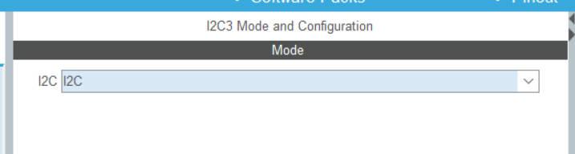

这边选择好后，修改一下参数

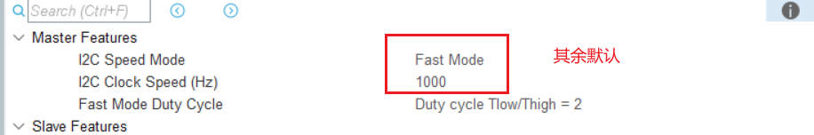

最后再把GPIO进行宏定义，然后导入两个oled的支持包就可以成功完成配置了

工程连接——[基于STM32的OLED屏驱动程序，支持软件或硬件I2C（HAL库）: 基于STM32 HAL库的0.96寸OLED（SSD1306）屏驱动程序，支持软件/硬件IIC](https://gitee.com/zeruns/STM32-HAL-OLED-I2C)

## 安装 DSP 库，以及宏定义

### 需要添加的宏定义

```C
ARM_MATH_CM4,__CC_ARM,ARM_MATH_M//f407用的就是ARM_MATH_CM4
```

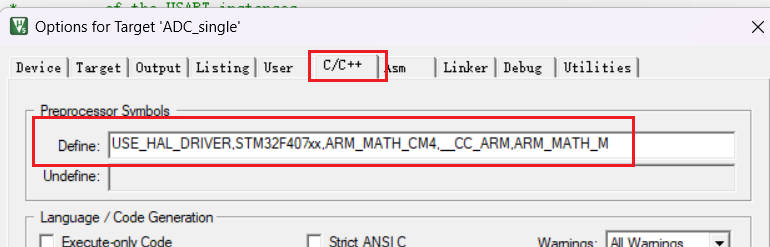

### 导入DSP库教程

我的DSP库没有选择，直接让CubeMX生成，而是选择后期通过，在keil中单独添加

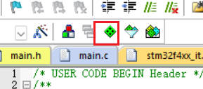

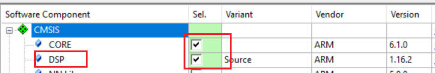

通过这样就可以把DSP库添加进去了

然后引用一下要用到的FFT的头文件

```C
#include "arm_math.h"
#include "arm_const_structs.h"
```

不报错就基本上成功了，下面给出测试示例教程——[stm32-HAL库-fft-测频率幅度_stm32 fft-CSDN博客](https://blog.csdn.net/2301_79131841/article/details/141310886?ops_request_misc=%7B%22request%5Fid%22%3A%22172411909116800178544334%22%2C%22scm%22%3A%2220140713.130102334.pc%5Fall.%22%7D&request_id=172411909116800178544334&biz_id=0&utm_medium=distribute.pc_search_result.none-task-blog-2~all~first_rank_ecpm_v1~rank_v31_ecpm-4-141310886-null-null.142^v100^pc_search_result_base7&utm_term=stm32-HAL库-fft-测频率幅度&spm=1018.2226.3001.4187)

## 定时器

### 什么是定时器？

​    定时器 顾名思义就是一个定时的器件。给定定时器一个初值，当定时器达到给定的初值时，会通知CPU或者其他处理器去做他们该做的事。可以理解为我们日常的闹钟，设置一个时间，该事件到达后，闹钟会提醒我们去做该做的事。

​	定时器 可以认为是一个计数器；给定计数器一个初值，每当计数一次，就会走过一个固定的时间（等同于我们的钟表，固定的进行扫描），当达到我们给定的初值时，该定时器就完成了自己的使命，产生定时器中断，执行中断函数中的程序命令（等同于闹钟响了，提醒我们该做更重要的事是一个意思）。

### f4定时器

参考文章链接——[STM32F4_定时器精讲(TIM)_stm32f4定时器-CSDN博客](https://blog.csdn.net/light_2025/article/details/128601186?ops_request_misc=%7B%22request%5Fid%22%3A%22172291854016800180642152%22%2C%22scm%22%3A%2220140713.130102334.pc%5Fall.%22%7D&request_id=172291854016800180642152&biz_id=0&utm_medium=distribute.pc_search_result.none-task-blog-2~all~first_rank_ecpm_v1~rank_v31_ecpm-1-128601186-null-null.142^v100^pc_search_result_base7&utm_term=《STM32F4_定时器精讲(TIM)》&spm=1018.2226.3001.4187)

**STM32F4** 板载了高级控制定时器（TIM1和TIM8）、通用定时器（TIM2到TIM5）、通用定时器（TIM9到TIM14）以及基本定时器（TIM6和TIM7）等，总共达14个定时器之多。


从时钟树中我们可以得知
（1）高级定时器timer1, timer8以及通用定时器timer9, timer10, timer11的时钟来源是**APB2总线**
（2）通用定时器timer2-timer5，通用定时器timer12-timer14以及基本定时器timer6,timer7的时钟来源是**APB1总线**

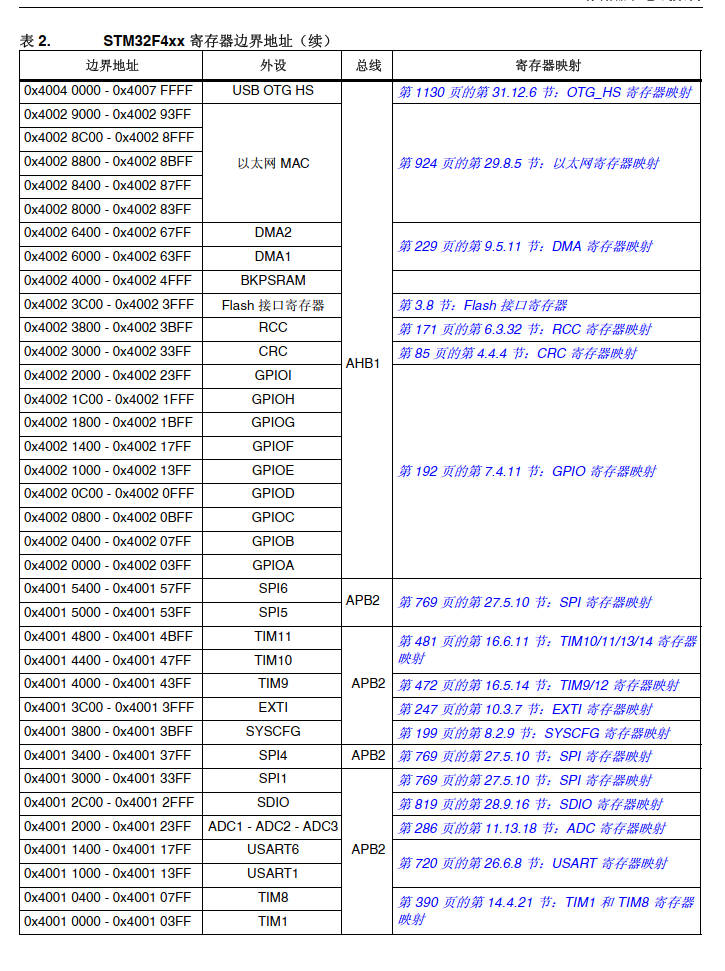

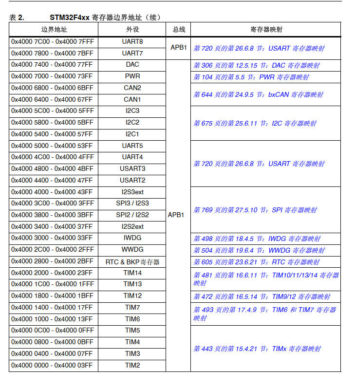

对应的时钟设置的图像为

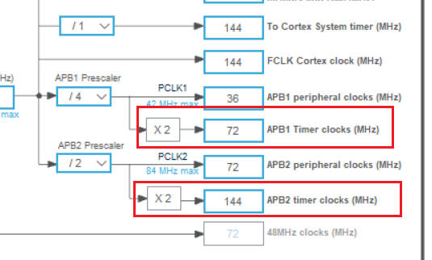

### 测周法和计数法


### 使用定时器来测量频率

### 使用FFT来测量多个频率

#### 什么是FFT

**FFT即快速傅立叶变换**，可以将一个时域信号变换到频域。因为有些信号在时域上是很难看出什么特征的，但是如果将其变换到频域之后，就很容易看出特征了，这也就是很多信号分析都会采用FFT变换的原因。其次，FFT可以将一个信号的频谱和相位提取出来，这在频谱和相位分析中也是经常用到的。
在实际工程中，一般的处理过程是先对一个信号在时域进行采样，如ADC采样，按照一定大小采样频率F去采集信号，采集N个点，那么通过对这N个点进行FFT运算，就可以得到这个信号的频谱和相位特征。

# 杂项

## cubeMX生成代码配置

### 时钟树配置


### 文件生成导出

这边勾选上单独生成`.c` `.h`文件


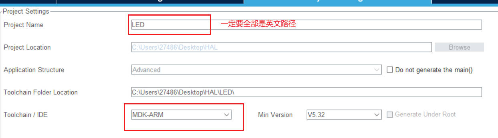

## keil5 如何添加.h 和.c 文件

在 hal 库的编程中一般会生成如下的几个文件夹，在这几个文件夹内存储着各种外设所需要的函数接口 `.h` 文件，和实现函数具体功能的 `.c` 文件，但是为了更方便的开发，我们有时候需要添加 `DSP库`，也就是自己的 `.c` 和 `.h` 文件

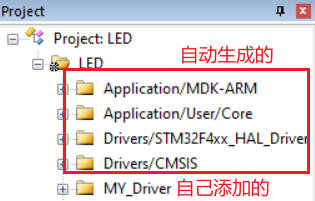

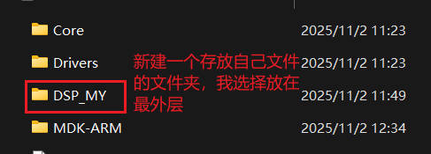

其实这个文件的地址并没有什么关系，只要后面把文件夹添加到链接路径即可，后续就是把这个文件夹的内容添加到 keil 当中了，具体的操作过程就跟下面的图像差不多。

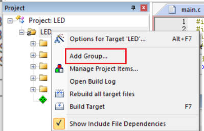


添加文件后，就是要把编译路径包含进去，寻找路径点击 `魔术棒`，然后 `C/C++`, 在 `include path` 中添加即可


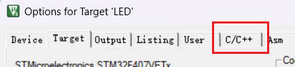

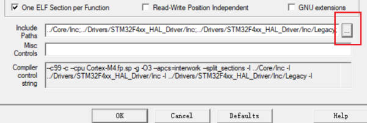

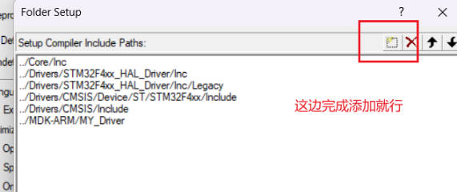

这样子就可以开始编写自己的头文件了。

## 文件的基础格式设置

**头文件负责 “声明”（函数声明、宏定义、类型定义、外部变量声明等），源文件负责 “实现”（函数定义、变量定义等）**

### .h文件

#### 一般的头文件的定义规范

大多数的`.h`文件都是这样定义的，这样定义的原因是防止重复定义，因为一个头文件会在很多的文件中被引用。

```c
#ifndef _KEY__H_  // 检查 _KEY__H_ 这个宏是否未定义
#define _KEY__H_  // 如果未定义，就定义这个宏
#include "main.h"
void KEY_Scan(void);
#endif             // 结束条件判断
```

第一次包含 `key.h` 时，`_KEY__H_` 尚未定义，因此会执行 `#define _KEY__H_` 并包含头文件内的内容（`#include "main.h"` 和函数声明）。后续再次包含 `key.h` 时，`#ifndef _KEY__H_` 会发现 `_KEY__H_` 已被定义，于是直接跳过中间的内容，直到 `#endif`

这样就确保了头文件的内容**只会被编译一次**，避免重复定义错误。

#### 其中包含`main.h`的原因

`main.h`通常会包含项目中**<span style="font-size:1.5em;">全局通用的类型定义、宏定义或常量</span>**，例如：

- 基础数据类型（如`uint8_t`、`int32_t`等，通过`#include "stdint.h"`引入）；
- 项目级别的宏（如错误码`#define ERROR 0`、成功标识`#define SUCCESS 1`）；
- 硬件相关的全局配置（如系统时钟频率`SYSCLK_FREQ`、外设使能标志等）。

HAL 层（硬件抽象层）的代码（如`stm32f4xx_hal_uart.h`、`key.h`等）需要使用这些通用定义来保证类型匹配或逻辑一致性，因此会通过包含`main.h`间接获取这些全局信息。

### .c文件

#### 一般的源文件的定义规范

一般会把所有用到的`.h`文件都放在.h文件当中，然后外设只使用当前文件的`.h`,在文件中也主要是一些逻辑代码

```c
#include "key.h"  // 只需包含自身头文件，间接获取所有依赖
// 实现头文件中声明的KEY_Scan函数
void KEY_Scan()
{
    if(KEY1 == GPIO_PIN_SET)
    {
        while (KEY1 == GPIO_PIN_SET);  // 等待按键释放（消抖简化）
        HAL_GPIO_TogglePin(LED_Blue_GPIO_Port, LED_Blue_Pin);
        HAL_Delay(30);  // 简单消抖
        Uart_printf(&huart1, "LED已经翻转", 11); 
    }
}
```

#### 外部变量

外部变量（如`huart1`）：在定义它的.c 文件（`usart.c`）中定义，在对应的.h 文件（`usart.h`）中用`extern`声明，其他文件通过包含该.h 文件间接使用。

## 8种GPIO模式

### **输入模式（Input Modes）**

| 模式名称（英文）            | 核心特点                                                     | 典型应用场景                                                 |
| --------------------------- | ------------------------------------------------------------ | ------------------------------------------------------------ |
| 浮空输入（Floating Input）  | 引脚为高阻抗状态，电平完全由外部电路决定，无内部上拉 / 下拉电阻，易受干扰。 | 接收外部明确驱动的信号（如 USART_RX、红外接收、外部传感器主动输出信号）。 |
| 上拉输入（Pull-up Input）   | 内置上拉电阻，无外部信号时默认高电平；外部信号可拉低电平。   | 按键检测（一端接 GND，按下时引脚被拉低）、外部低电平触发的状态检测。 |
| 下拉输入（Pull-down Input） | 内置下拉电阻，无外部信号时默认低电平；外部信号可拉高电平。   | 按键检测（一端接 VCC，按下时引脚被拉高）、外部高电平触发的状态检测。 |
| 模拟输入（Analog Input）    | 引脚直通内部 ADC/DAC，无数字缓冲和上拉 / 下拉电阻，用于采集连续模拟信号。 | 与 ADC 配合测量传感器信号（如电压、温度）、音频输入等模拟量。 |

### **输出模式（Output Modes）**

| 模式名称（英文）                     | 核心特点                                                     | 典型应用场景                                                 |
| ------------------------------------ | ------------------------------------------------------------ | ------------------------------------------------------------ |
| 推挽输出（Push-Pull Output）         | 可主动输出高 / 低电平，驱动能力较强，电平由 CPU 直接控制输出寄存器。 | 驱动 LED、继电器、外部逻辑电路（如舵机信号、普通控制信号）。 |
| 开漏输出（Open-Drain Output）        | 仅能主动拉低电平，输出高电平需外部上拉电阻；支持 “线与” 逻辑。 | I2C 总线（SDA/SCL）、多设备共享总线、5V 电平兼容通信（通过外部上拉匹配电平）。 |
| 复用推挽输出（AF Push-Pull Output）  | 具备推挽输出特性，但引脚功能由外设（如 USART、定时器）控制，非 CPU 直接驱动。 | USART_TX、SPI_MOSI、定时器 PWM 输出（外设控制信号输出）。    |
| 复用开漏输出（AF Open-Drain Output） | 具备开漏输出特性，引脚功能由外设控制，需外部上拉电阻。       | I2C 外设复用引脚、USART_RX（部分场景）、外设故障信号输出（共享总线场景）。 |

# 范例

