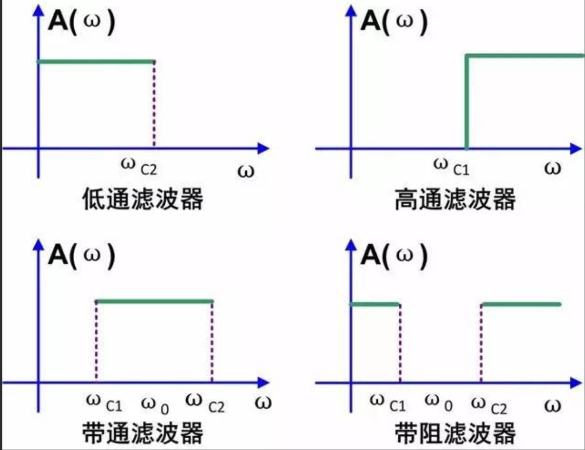
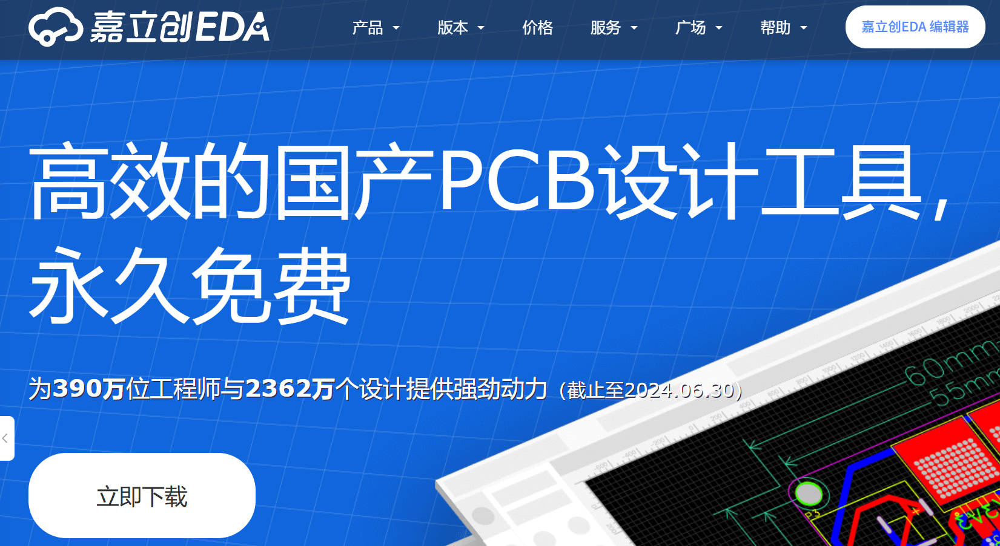
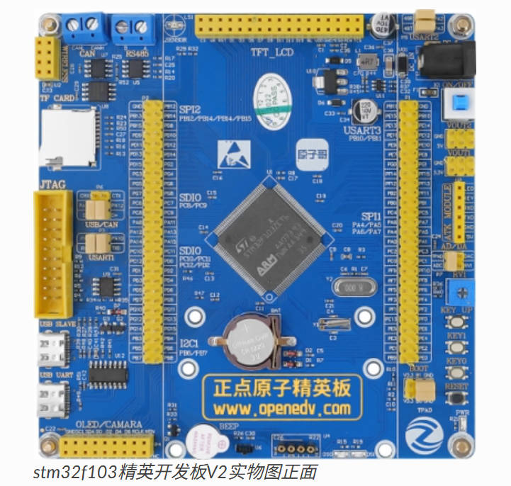
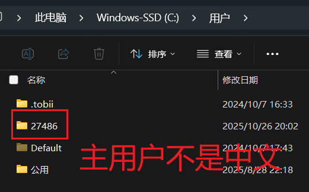
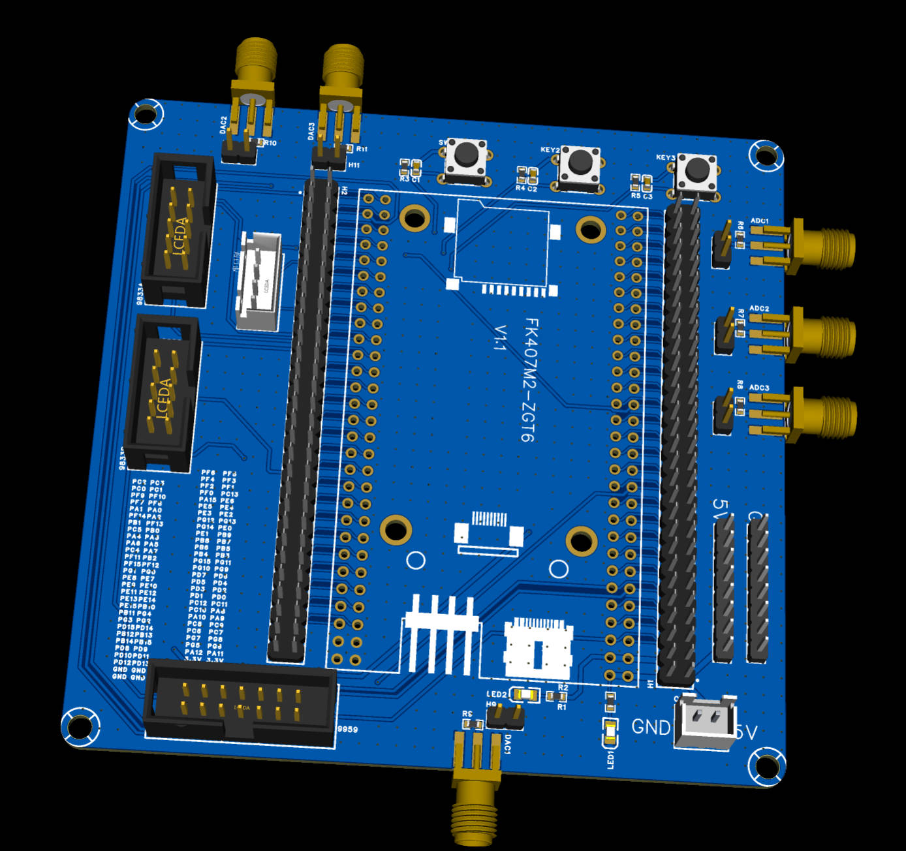

[TOC]

# 提前告知

如果你是电脑小白，那么我推荐你先看这本书[你缺失的那门计算机课](http://10.11.197.69:5244/d/!%E4%BD%A0%E7%BC%BA%E5%A4%B1%E7%9A%84%E9%82%A3%E9%97%A8%E8%AE%A1%E7%AE%97%E6%9C%BA%E8%AF%BE.pdf?sign=vFqAuZJPQGoGjnJ7gi7cx4zzy0az6u-B94vo6YRSzgA=:0)【需要使用校园网】

# 寄语

首先很高兴你可以看见这篇文章，文章里或多或少会提及一些对你有帮助的知识，首先电赛我们主要就打两个方向**高频题**【分为收发|解调】以及仪器仪表了，在实验室中，往往有以下几种身份可以供你选择，硬件的方向、软件的方向、或两者都接触一些【这个需要你有蛮大的精力投入的】，电赛的人员构成是3人一组，队伍中至少有一个软件一个硬件，不然总不能三个硬件的用纯硬件的方式来解决题目吧。

# 前置知识

- 模电
- 数电
- C语言
- 信号与系统
- 数字信号处理
- 通信原理
- 很多。。。真的是学到后面恍然大悟的感觉

# 硬件部分

## 滤波器的设计

在电子设计竞赛中，滤波器是信号处理模块的关键组成部分，其核心功能是依据频率特性对输入信号进行筛选，实现有用信号的保留与干扰信号的抑制。

以下从**硬件实现类型**与**频率选择类型**两个维度，对电赛常用滤波器进行梳理。

### 按频率选择分类

- **低通滤波器（LPF）**：允许频率低于**截止频率（fc）** 的信号通过，抑制频率高于 fc 的信号。
- **高通滤波器（HPF）**：允许频率高于截止频率（fc）的信号通过，抑制频率低于 fc 的信号。
- **带通滤波器（BPF）**：仅允许特定频段（以**中心频率（f0）** 为核心，包含通带宽度）的信号通过，抑制频段外的所有信号。
- **带阻滤波器（BEF）**：抑制特定频段（陷波频段）的信号，允许其他频率的信号正常通过，又称 “陷波器”
- [滤波器基础链接](https://blog.csdn.net/weixin_42837669/article/details/127147625)

### 按滤波器类型分类

- 无源滤波器（RC、LC 与 RCL 滤波器）：无源滤波器仅由无源元件（电阻 R、电容 C、电感 L）组成，无需外部电源供电，结构相对简单，是电赛中低频、高频信号处理的基础方案。
- 有源滤波器（基于运放的滤波方案）有源滤波器以无源元件（RC 为主，极少用 LC）为基础，加入运算放大器（如 LM358、OPA2277）等有源器件，需外部电源供电，具备增益调节、带负载能力强等特点，是电赛中小信号精准滤波的核心选择。

### 滤波器设计的软件

有关滤波器的设计，你可能会接触到以下几个软件（并不是全部还有更好用的软件）

- Filter Solutions 2015
- NI Multisim 14.3
- FilterPro Desktop

## PCB的设计（以嘉立创为例）

自制PCB在电赛中是很重要的一环，相比于刻蚀板子，PBC模块能够使信号更加纯净，也可以更快的搭建处理型号的电路。因此实验室往往会准备很多模块，那么接下来来简单介绍一下如何实现绘制自己的第一块PCB。

### 入门PCB设计软件嘉立创

#### 如何安装软件——[嘉立创下载网址](https://lceda.cn/)

一般**标准版**和**专业版**都可以安装，使用**全在线**和**半离线**模式都可以，我个人推荐使用全在线版本，这样到哪里都可以使用，嘉立创还能白嫖打样，每个月两张（yyds）

#### 了解什么是EDA设计软件

其实EDA设计软件主要包含许多方面，包含原理图的绘制、PCB上的连线、以及实物的焊接。

#### 原理图设计

前期设计好使用什么芯片，怎样进行阻抗匹配，这些信息都将体现在原理图上，后续的修改也都需要根据原理图来设计。[什么是原理图](https://www.bilibili.com/video/BV1e4411L7Bc?spm_id_from=333.788.recommend_more_video.-1&vd_source=96be7416b9fedd6f451a1bd2737979a5) 看这个视频可以更好的了解学长说的**原理图**是什么

##### 芯片选型

一般会使用`半导小芯`这个微信公众号，或者是这个网站[半导小芯网址](https://www.semiee.com/)

##### 寻找原理图

几个来源主要是这几个网站

- [立创开源平台](https://oshwhub.com/)
- CSDN搜索
- [51黑电子](http://www.51hei.com/bbs/)
- [电赛培训网](https://www.nuedc-training.com.cn/)
- 。。。。奇奇怪怪的来源

#### 初见嘉立创

根据下方的视频，你可以快速了解一下嘉立创的使用简单技巧[嘉立创使用技巧视频](https://www.bilibili.com/video/BV1At421h7Ui/?spm_id_from=333.337.search-card.all.click)这个UP主讲的很好可以关注

##### PCB布局

主要是元件的摆放以及走线的粗细（经验为主）

可以通过观看以下几个视频来了解：

- [初学PCB布局](https://www.bilibili.com/video/BV1Wb4y1p7cf/?spm_id_from=333.337.search-card.all.click&vd_source=96be7416b9fedd6f451a1bd2737979a5)
- [经验分享](https://blog.csdn.net/weixin_53384447/article/details/135643300?ops_request_misc=%7B%22request%5Fid%22%3A%225ea98b10e959f7ad8179678a92c9bfdc%22%2C%22scm%22%3A%2220140713.130102334..%22%7D&request_id=5ea98b10e959f7ad8179678a92c9bfdc&biz_id=0&utm_medium=distribute.pc_search_result.none-task-blog-2~all~top_click~default-2-135643300-null-null.142^v102^pc_search_result_base7&utm_term=pcb布局&spm=1018.2226.3001.4187)

#### 了解运放的几种连接方式

以下这个文章可以说是讲的非常好。[20种经典运放电路总结](https://blog.csdn.net/luolt42/article/details/128811214?ops_request_misc=%7B%22request%5Fid%22%3A%22bff6976bdec65f66916add1c4ad75888%22%2C%22scm%22%3A%2220140713.130102334..%22%7D&request_id=bff6976bdec65f66916add1c4ad75888&biz_id=0&utm_medium=distribute.pc_search_result.none-task-blog-2~all~baidu_landing_v2~default-1-128811214-null-null.142^v102^pc_search_result_base7&utm_term=几种典型运放电路&spm=1018.2226.3001.4187)

------

那么硬件的入门就先讲到这里，接下来的是软件入门

# 软件部分

提及软件，那么必然离不开使用单片机，如果你不知道什么是单片机，那这很坏了，请努力。一般我们使用的型号是`stm32f103zet6`(一块比较完整的功能板，各种功能都集成在上面了)，`f407zet6`、`H750系列`，关于每个系列为何如此命名你可以看接下来这个链接——[STM32系列芯片命名](https://blog.csdn.net/ST_Liam/article/details/108922753)，然后开发板子的语言也有两种选择使用**标准库**或者**HAL库**，两者学习都需要大量的时间，标准库有许多留下来的驱动遗产，但是HAL库编写框架更加快速。

## 认识板子

你拿到的大概率是一块正点原子的精英版，但是他并不是终点，407、750还在等待你的挑战。

## 软件安装

### 安装Keil

#### 温馨提示

1. 安装路径不能带中文，必须是英文路径
2. 安装目录不能跟 51 的 KEIL 或者 [KEIL4](https://so.csdn.net/so/search?q=KEIL4&spm=1001.2101.3001.7020) 冲突，三者目录必须分开
3. KEIL5 的安装比起 KEIL4 多了一个步骤，必须添加 [MCU](https://so.csdn.net/so/search?q=MCU&spm=1001.2101.3001.7020) 库，不然没法使用。
4. 亲测可用。

这会是一个复杂的过程，请首先确保你的用户名不是中文用户名！！，不然在后续你将会遇到**无穷无尽**的麻烦。

关于如何破解keil，网上的教程有很多——[KEIL5（MDK5.35）安装与破解教程](https://blog.csdn.net/qq_51776551/article/details/139784977?ops_request_misc=%7B%22request%5Fid%22%3A%227d594b1454ea4a8bae9a2aeed8d061df%22%2C%22scm%22%3A%2220140713.130102334..%22%7D&request_id=7d594b1454ea4a8bae9a2aeed8d061df&biz_id=0&utm_medium=distribute.pc_search_result.none-task-blog-2~all~sobaiduend~default-1-139784977-null-null.142^v102^pc_search_result_base6&utm_term=破解keil&spm=1018.2226.3001.4187)这里也是放出一个教程的连接

#### 具体讲解一下如何安装破解keil

相信经过大一，很多同学都配置好了在keil下的C51的开发环境，但是开发32需要

### 安装CubeMX以及CubeIDE（选做为了开发HAL）

[保姆级教程——来自波特律动](https://docs.baud-dance.com/docs/stm32/getting-started)

### 安装DSP库（必修）

DSP库是用来处理fft等信息的一个库，两个教程连接也是在下面了

[STM32F103 KEIL 标准库直接添加DSP库_keil目录下没有dsp文件夹-CSDN博客](https://blog.csdn.net/physicsexpert/article/details/125836181)

[在keil中加入DSP库并且使用arm_math.h - 海滩长颈鹿 - 博客园](https://www.cnblogs.com/FFFXX/p/16021904.html)

### 安装VScode以及配置AI工具和EIDE（选做，可以快速开发）

## 课程学习

在学习单片机的时候你会遇到以下两个主流代码基础库，但是在学习这些之前，我还是希望你可以看一遍每一个嵌入式入门都会看的视频，江科大51单片机（也许不需要动手实操，但是详细理解一下寄存器的操作感觉）

| 名称         | Hal库                                                        | 标准库                                                       |
| ------------ | ------------------------------------------------------------ | ------------------------------------------------------------ |
| **优缺点**   | 快速，但是理解较难                                           | 入门耗时久，但是广泛                                         |
| **视频网址** | [【keysking】易懂的STM32教程](https://www.bilibili.com/video/BV12v4y1y7uV/?spm_id_from=333.1387.homepage.video_card.click&vd_source=96be7416b9fedd6f451a1bd2737979a5) | [江科大的教程永远的神](https://www.bilibili.com/video/BV1th411z7sn/?spm_id_from=333.337.search-card.all.click&vd_source=96be7416b9fedd6f451a1bd2737979a5) |

Hal库的推荐视频，只是快速入门，可以看一下。

## 学习重点

由于我们比赛的重点是高频题和仪器仪表，那么我们学习的重心也有所不同，你需要重点学习的方向有

- 时钟的分频分配
- ADC的采样率与精度的关系
- DMA的中断
- DMA双循环

## 模块的了解与使用

电赛中模块分为很多类别，每一种模块的功能都需要你熟记于心。因为可能这次没用上的模块，下一次就又用上了。

### 滤波器有源|无源

无源滤波器由 R、L、C 等无源元件构成，无需供电，结构简单，适合高频或大功率场景（如 LC 滤除电源纹波），但带负载能力弱。有源滤波器加入运放，可调节增益、带负载能力强，适合低频精密滤波（如 RC 有源滤除 50Hz 干扰），需供电，受运放带宽限制。

### DDS

直接数字频率合成器（DDS）通过数字信号生成高精度、高稳定性的模拟信号（如正弦波、方波），频率可通过数字控制精确调节，跳频速度快。电赛中常用于信号源设计，如产生可调频的激励信号，搭配示波器验证滤波电路性能。

### DAC

数模转换器（DAC）将数字量（二进制代码）转换为对应模拟电压 / 电流信号，是数字系统与模拟电路的桥梁。电赛中多用于波形生成（如通过单片机控制 DAC 输出特定波形）、数字控制电源（调节输出电压），精度取决于位数（如 12 位 DAC 误差更小）。

### 加法器

由运放构成，可对多路模拟信号进行代数求和（含正负值），输出为输入信号的加权总和。电赛中用于信号叠加场景，如将多个传感器的微弱信号汇总放大，或实现信号调制中的载波与基带信号叠加。

### 乘法器（AD835）

专用模拟乘法器芯片，可实现两路模拟信号的实时相乘，带宽达几百 MHz，精度高。电赛中用于振幅调制（如将基带信号与载波相乘）、信号混频预处理，或实现功率计算（电压与电流相乘得功率）。

### 混频器（AD831）

将高频信号与本地振荡信号混频，输出两者的频率差（中频信号），实现信号频率变换。电赛中用于无线通信接收模块，将射频信号（如 433MHz）下变频为低频信号以便后续处理，集成度高，适合快速搭建通信链路。

# 杂项部分

杂项也当然重要，只有单片机和硬件并不是万能的，还需要更快的方法，在这个模块你将学到

## 仪器的使用

- 示波器的使用——>
- 万用表的使用——>[万用表使用教程（详细版）](https://www.zhihu.com/tardis/zm/art/546128461?source_id=1005)
- 频谱仪的使用
- 信号源的使用
- 射频源的使用

## 焊接

- 焊接0603的小电阻
- 焊接BGA封装的芯片
- 焊接很小间距的芯片
- 使用焊台、热风枪和烙铁来帮助焊接
- .........

## 串口屏的交互逻辑（陶晶驰串口屏）

使用软件`USART HMI`下载链接——[下载和安装上位机软件](http://wiki.tjc1688.com/start/download_ide.html)

### 串口屏的教程

在官方网站中会有很多教程的，主要就是实现串口屏发回的数据在mcu中能够被处理，然后实现一些**离机调试**

## matlab的仿真实现

得益于matlab的强大功能和Ai的强大，有些题目可以通过matlab的仿真来进行模拟，从而帮助我们来解决 实际的问题。

## 数据的快速拟合

结合matlab和串口调试

## 串口调试工具

- 波特律动在线调试——[串口网站链接](https://serial.baud-dance.com/#/)
- vofa+——[VOFA-Plus上位机 | VOFA-Plus上位机](https://www.vofa.plus/)
- XCOM

## 模块的归类

模块的excel的归类

## 绘制自己的一块常用的主板

有自己一块常用的板子和配套的代码能够事半功倍。接线也更加美观。

# 快速入门

## 硬件方向——设计一个加法器打板并焊接测试

简单的第一次任务，搜索二路加法器的原理图，并通过`NI Multisim`软件进行原理图仿真验证，然后绘制PCB给学长查看布局。（对的，这只是入门）

## 软件方向——ADC读取配置DSP库输出三角函数的值
