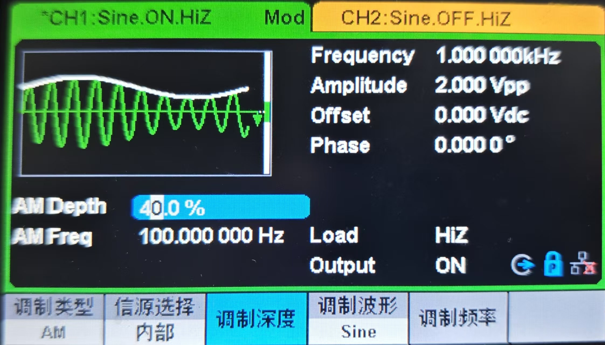
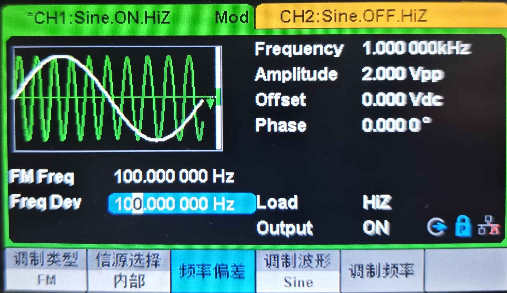

---

title: 仪器使用之信号源
slug: dian-yiqi
description: 讲解了如何使用信号源
date: 2025-11-11T22:28:00+08:00
hidden: true
tags:
  - 教程
  - hidden
 
---

# 实验室示波器介绍

实验室共有两款信号源

1. SDG1062（老示波器）——鼎阳（Siglent）

   - 最大输出频率60MHz

   - 采样率150MSa/s

   - 最大输出幅度20Vpp

2. DG4202（新款示波器）——普源（RIGOL）

   - 最大输出频率200MHz

   - 采样率500MSa/s

# SDG1062使用

## 生成AM波以及参数的作用

## AM参数解释

### Frequence

即载波的频率，就是进行填充的信号的频率

### **Amplitude（载波幅度）**

- **定义**：指载波信号的最大幅值，即未调制时正弦波的峰值。
- 作用：
  - 直接决定 AM 波的整体能量水平。例如，若载波幅度为 \(A_c\)，则 AM 信号的最大瞬时幅值为 \(A_c \times (1 + \text{调制深度})\)。
  - 与调制信号幅度共同影响调制深度m = $\frac{\text{调制信号幅度}}{A_c}$。若 \(m > 1\)，会导致过调制，引发包络失真。
- **示例**：若载波幅度设置为 10V，调制信号幅度为 5V，则调制深度为 50%，AM 波的最大幅值为 15V，最小幅值为 5V。
- **示例：**如果Amplitude=2Vpp，AM Depth为40%，出来的am波幅度为2.8V,中心为0

###  **Offset（直流偏移）**

- **定义**：叠加在调制信号上的直流分量，用于调整调制信号的基线位置。
- 作用：
  - **防止过调制**：若调制信号包含负值，通过添加正偏移（如 \(A_0\)）可确保 \(A_0 + \text{调制信号} \geq 0\)，避免载波幅值在调制过程中变为负数，从而保证包络检波的正确性。
  - 调整调制类型：
    - 当 \(A_0 = 0\) 时，产生抑制载波的双边带调制（DSB-SC），此时 AM 波仅含边带信息，无载波成分。
    - 当 \(A_0 > 0\) 时，为常规 AM 调制，载波与边带同时存在。
- **示例**：若调制信号为正弦波 $3\cos(2\pi f_m t)$，设置偏移为 5V，则实际参与调制的信号为 \(5 + 3$cos(2pi f_m t)$\)，确保载波幅值始终为正。

### **Phase（载波初始相位）**

- **定义**：载波信号在 \(t = 0\) 时刻的相位偏移，通常以弧度（rad）为单位。
- 作用：
  - **调整波形起点**：改变相位会使载波正弦波在时域上左右平移，但不影响其频率或幅度。例如，相位为 \(\pi/2\) 时，载波波形相当于余弦波。
  - **多信号同步**：在多载波通信或相干解调中，相位对齐至关重要。若接收端载波相位与发送端不一致，可能导致解调错误。
- **示例**：载波信号 \(A_c \cos(2\pi f_c t + \phi)\) 中，\(\phi = 0\) 对应标准正弦波，\(\phi = \pi\) 则波形反相。

### AM Freq （AM波的幅度）

即外部包络的频率

## 生成FM波以及参数的作用

## FM参数解释（Amplitude、Offset、Phase）

这些参数定义了**未调制时载波信号的固有属性**，即使开启调制（如图中 FM），载波的基础特性仍由它们决定。

### **Amplitude（幅度，2.000 Vpp）**

- **定义**：载波信号的**峰 - 峰值电压**（从正峰到负峰的差值），反映信号能量强度。

- 影响：

  - 对调制的影响：

    在 **FM/PM 调制** 中，载波幅度不影响频率 / 相位变化，但决定输出信号的**功率**（幅度越大，功率越高）。

  - **对波形的影响**：直接决定信号的 “垂直高度”，幅度越大，波形上下摆动范围越广。

### **Offset（偏移，0.000 Vdc）**

- **定义**：载波信号的**直流偏置**，使信号整体在直流电平上平移（以 0V 为基准）。

- 影响：

  - 对调制的影响：

    在 **FM/PM 调制** 中，偏移仅改变信号的直流电平（若负载为交流耦合，偏移会被滤除；直流耦合时会保留）。

    #### 1. **直流耦合（DC Coupling）**

    - **定义**：电路直接连接（无隔直电容），允许 **直流分量（偏置电压）和交流分量（变化信号）同时传输**。
    - **原理**：信号的直流电平（如 Offset 偏移）和交流波动（如正弦波的变化）都能通过导线直接传递，相当于 “直通” 信号的全部成分。

    #### 2. **交流耦合（AC Coupling）**
  
    - **定义**：电路中串联 **隔直电容**，**阻断直流分量，仅允许交流分量通过**。
    - 原理：利用电容 “通交流、阻直流” 的特性：
      - 直流信号：电容相当于开路，无法通过；
      - 交流信号：电容随信号频率充放电，形成交流通路（频率越高，电容容抗越小，越容易通过）。
  
  - **对波形的影响**：使载波波形整体上移或下移，例如偏移为正，波形中心会处于正电压区。

#### **Phase（相位，0.0000°）**

- **定义**：载波信号在 **t=0 时刻** 的相位偏移（角度制），决定波形的**起始点**。

- 影响：

  - 对调制的影响：

    - 在 **相干解调**（如 AM 同步解调、FM 相干解调）中，载波相位必须与接收端**严格同步**，否则解调误差会急剧增大。
  - 多载波系统中，相位决定信号间的**同步关系**（如 MIMO 系统的相位对齐）。
  
- **对波形的影响**：改变波形的起始相位，例如 90° 相位会使正弦波变为**余弦波**（起始点在峰值）。

### **调制相关参数（Frequency、FM Freq、Freq Dev、调制类型）**

图中调制类型为 **FM（频率调制）**，以下参数描述**调制信号与载波的相互作用**：

#### 1. **Frequency（1.000000 kHz）**

- **定义**：**调制信号的频率**（即基带信号频率，如图中是 1kHz 的正弦波，作为 FM 的调制源）。

- 影响：

  - **对 FM 的影响**：调制频率决定载波频率**变化的快慢**（频率越高，单位时间内载波频率变化越频繁）。
- **与 Freq Dev 的关联**：调频指数 \(m_f = \frac{\text{频率偏移（Freq Dev）}}{\text{调制频率（Frequency）}}\)，\(m_f\) 越大，FM 信号的**频谱边带越多**（带宽越宽）。

#### 2. **FM Freq（100.000000 Hz → 实际应为 100 MHz，单位可能显示误差）**

- **定义**：**载波的中心频率**（FM 调制中，未调制时的固有频率）。

- 影响：

  - **通信频段**：决定信号所处的频段（如广播 FM 为 88-108 MHz），高频载波更易受衰减，但支持更高带宽。
- **与 Freq Dev 的关联**：通过 **Carson 公式** 计算 FM 信号带宽：\(B \approx 2(\text{Freq Dev} + \text{调制频率})\)，载波频率越高，信号带宽的 “绝对范围” 越大。

#### 3. **Freq Dev（100.000000 Hz → 实际应为 100 MHz，单位可能显示误差）**

- **定义**：FM 调制中，载波频率随调制信号变化的**最大偏移量**（即载波频率从中心频率向上下摆动的幅度）。

- 影响

  ：

  - **信号信息量**：Freq Dev 越大，载波频率变化范围越广，理论上可携带的信息越多（但需配合带宽）。
  - **与调制频率的关联**：如前所述，调频指数 \(m_f\) 由两者共同决定，\(m_f \ll 1\) 是**窄带 FM**（频谱接近 AM），\(m_f \gg 1\) 是**宽带 FM**（频谱边带丰富）。

### **三、参数间的交叉影响总结**

| 参数          | 核心作用     | 与其他参数的关联                                             |
| ------------- | ------------ | ------------------------------------------------------------ |
| **Amplitude** | 载波能量强度 | 影响 AM 调制深度；决定 FM/PM 信号功率，不影响频率 / 相位变化。 |
| **Offset**    | 载波直流电平 | 调整 AM 调制基线（防过调制）；对 FM/PM 仅改变直流电平，不影响频率 / 相位特性。 |
| **Phase**     | 载波起始相位 | 相干解调的关键；多信号同步的基础，非相干解调（如普通 FM 鉴频）对相位不敏感。 |
| **Frequency** | 调制信号频率 | 与 Freq Dev 共同决定调频指数 \(m_f\)，影响 FM 频谱复杂度（边带数量）。 |
| **FM Freq**   | 载波中心频率 | 与 Freq Dev 通过 Carson 公式决定 FM 带宽；决定信号所处频段，影响传输特性（衰减、干扰）。 |
| **Freq Dev**  | 频率偏移幅度 | 与调制频率决定 \(m_f\)；直接影响 FM 信号的频率变化范围和带宽。 |

### **四、实际调试注意事项**

